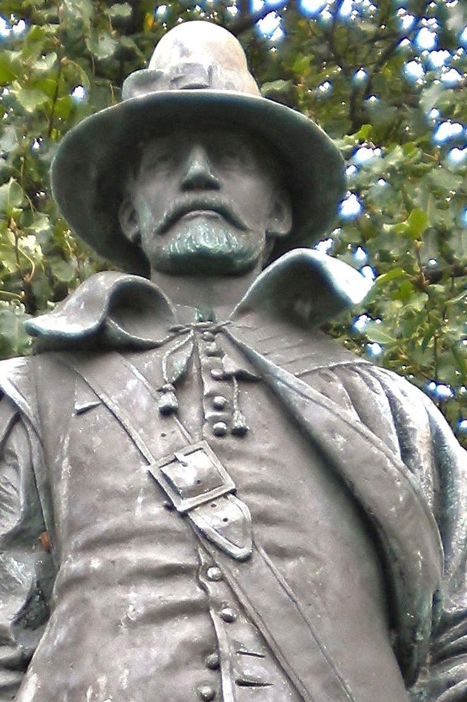
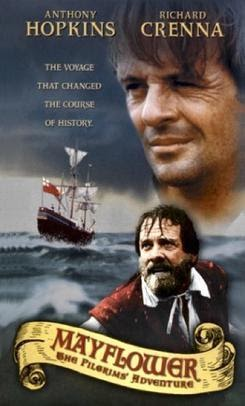
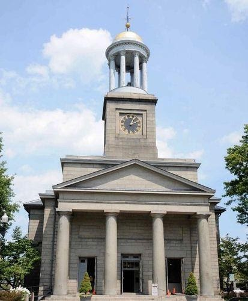
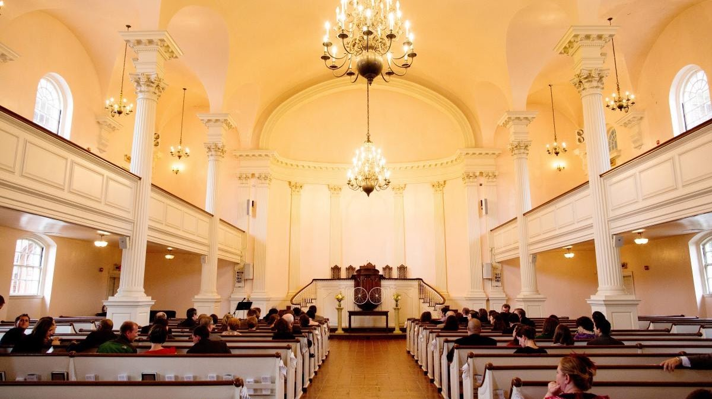

<section class="wrapper bg-light">
  

    

      

        <article class="card shadow-lg">
          

- [Congregationalists](https://www.congregationallibrary.org/for-researchers/search-obituaries)

Ecumenical

This National Council of Churches members  include
Evangelical [Lutheran ](https://www.firstfamilies.us/faith/lutheran)Church
in America,
American [Baptist](https://www.firstfamilies.us/faith/baptist) Churches
USA, [Moravian](https://www.firstfamilies.us/faith/moravians) Church in
America, Polish
National [Catholic](https://www.firstfamilies.us/faith/old-catholics) Church, [Presbyterian](https://www.firstfamilies.us/faith/presbyterians) Church
USA, [Friends United
Meeting](https://www.firstfamilies.us/faith/quakers),  [Philadelphia
Yearly Meeting,](https://www.firstfamilies.us/faith/quakers) [United
Church of
Christ](https://www.firstfamilies.us/faith/congregationalists), [Reformed
Church in America](https://www.firstfamilies.us/faith/dutch-reformed),
United [Methodist ](https://www.firstfamilies.us/faith/methodist)Church
and
the [Episcopal](https://www.firstfamilies.us/faith/episcopalian) Church
USA 

[Westminster Savoy Philadelphia Confessions of
Faith](https://drive.google.com/file/d/1OcGjZowpmyAyw3Ma_dftxYKEd7bfAGh2/view?usp=sharing)

In [England](https://www.firstfamilies.us/ancestors/england) in 1646
the [Presbyterians](https://www.firstfamilies.us/faith/presbyterians) wrote
the [Westminster Confession of
Faith](https://drive.google.com/file/d/1OcGjZowpmyAyw3Ma_dftxYKEd7bfAGh2/view?usp=sharing). 
In 1658
the [Congregationalists](https://www.firstfamilies.us/faith/congregationalists) took
the [Westminster Confession of
Faith](https://drive.google.com/file/d/1OcGjZowpmyAyw3Ma_dftxYKEd7bfAGh2/view?usp=sharing) and
added \"Congregational governance\" and called it the [Savoy Declaration
of
Faith](https://drive.google.com/file/d/1OcGjZowpmyAyw3Ma_dftxYKEd7bfAGh2/view?usp=sharing). 
In 1689 the [Baptist](https://www.firstfamilies.us/faith/baptist) took
the [Savoy Declaration of
Faith](https://drive.google.com/file/d/1OcGjZowpmyAyw3Ma_dftxYKEd7bfAGh2/view?usp=sharing) and
added \"Believers Baptism\" and called it the [London Baptist Confession
of
Faith](https://drive.google.com/file/d/1OcGjZowpmyAyw3Ma_dftxYKEd7bfAGh2/view?usp=sharing).
In [Pennsylvania](https://www.firstfamilies.us/events/pennsylvania), in
1742 the  [Baptist](https://www.firstfamilies.us/faith/baptist)  took
the  [London Baptist Confession of
Faith](https://drive.google.com/file/d/1OcGjZowpmyAyw3Ma_dftxYKEd7bfAGh2/view?usp=sharing) and
added 2 more ordinances: \"Signing\" and the \"Laying on of Hands\" and
called it the [Philadelphia Confession of
Faith](https://drive.google.com/file/d/1OcGjZowpmyAyw3Ma_dftxYKEd7bfAGh2/view?usp=sharing).

[William
Bradford](https://en.wikipedia.org/wiki/William_Bradford_%28governor%29)

William Bradford (c. 19 March 1590 -- 9 May 1657) was an English Puritan
Separatist originally from the West Riding of Yorkshire in Northern
England. He moved to Leiden in Holland in order to escape persecution
from King James I of England, and then emigrated to the Plymouth Colony
on the Mayflower in 1620. He was a signatory to the Mayflower Compact
and went on to serve as Governor of the Plymouth Colony intermittently
for about 30 years between 1621 and 1657. He served as a commissioner of
the United Colonies of New England on multiple occasions and served
twice as president. His journal Of Plymouth Plantation covered the years
from 1620 to 1646 in Plymouth.

List of Historical Congregational Churches

[First
Parish](https://www.firstfamilies.us/events/massachusetts/plymouth) Plymouth
MA.

[Evangelical Reformed United Church of
Christ](https://www.firstfamilies.us/events/maryland/frederick) 15 West
Church St. \| Frederick, MD

{width="2.5520833333333335in"
height="4.229166666666667in"}

[Mayflower
Pilgrims](https://en.wikipedia.org/wiki/Pilgrims_%28Plymouth_Colony%29)

The Pilgrims, also known as the Pilgrim Fathers, were the English
settlers who traveled to America on the Mayflower and established the
Plymouth Colony in Plymouth, Massachusetts (John Smith had named this
territory New Plymouth in 1616, coincidentally sharing the name of the
Pilgrims\' final departure port of Plymouth, Devon.). The Pilgrims\'
leadership came from the religious congregations of Brownists, or
Separatist Puritans, who had fled religious persecution in England for
the tolerance of 17th-century Holland in the Netherlands.

Geneva Bible

Evangelical Catechism

{width="4.302083333333333in"
height="5.208333333333333in"}

[United First Parish Church](https://ufpc.org/presidential-wreathlaying)

**Honoring
the [Adams](https://www.firstfamilies.us/ancestors/england/adams) Presidents
as a part of a national wreath-laying tradition. **Twice each year the
President of the United States sends a wreath to the  United First
Parish Church to be placed on the tomb of the Adams Presidents.  This
national tradition started during the administration  of President
Lyndon Johnson in 1967. Each year,  wreaths of red, white  and blue
flowers are sent to the burial places of all deceased  presidents on the
anniversary of their birthday**. **The  United First Parish Church,
Church of the Presidents is the proud keeper of this important annual
recognition of our Presidential  heritage.  Admission  to the
wreath-laying ceremony, the Adams Crypt and Church Sanctuary are  free.
Donations to support the History and Visitors Program are greatly 
appreciated. United First Parish Church is located at 1306 Hancock
Street, Quincy, MA 02169.

  

**For more information about the ceremonies, please
email [office@ufpc.org]{.underline} or call 617-773-1290.  **

All Souls Church DC (Unitarian)

Founded by President John
Quincy [Adams](https://www.firstfamilies.us/ancestors/england/adams) and
Vice President John C. Calhoun. Listed in the National Register --
Reference
number [100005905](https://www.nps.gov/places/all-souls-church-unitarian.htm).
1500 Harvard St. NW Washington DC

          

        </article>
      

    

  

</section>
