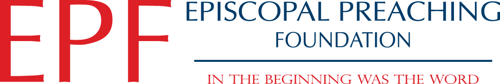
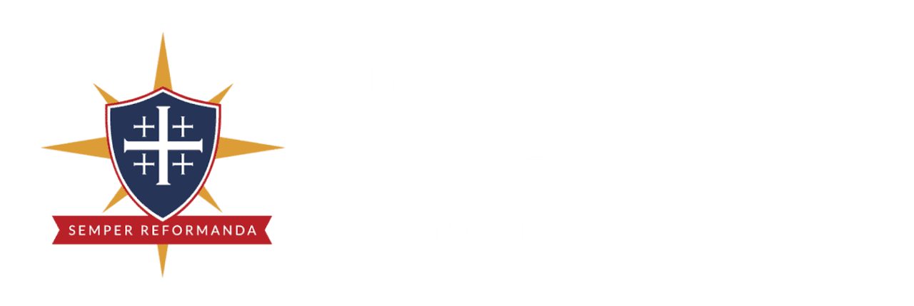
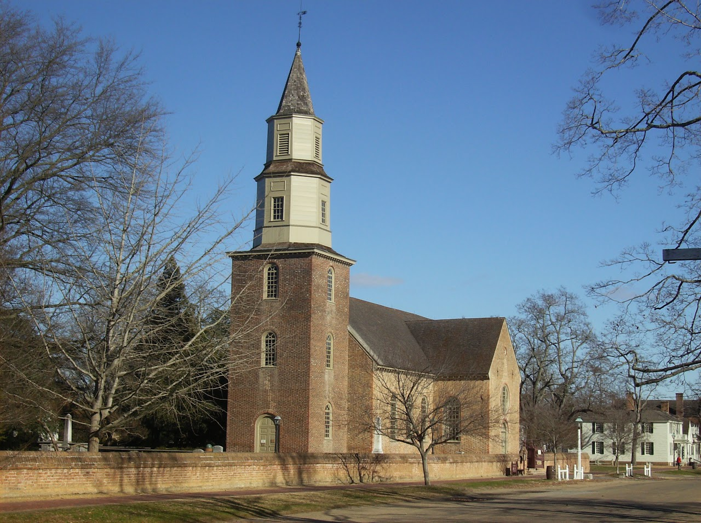
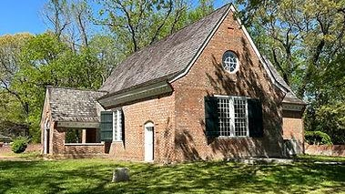
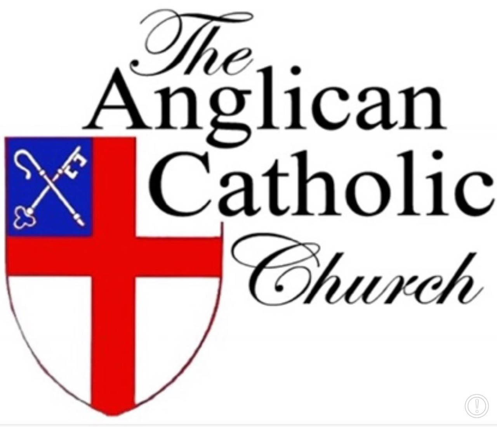
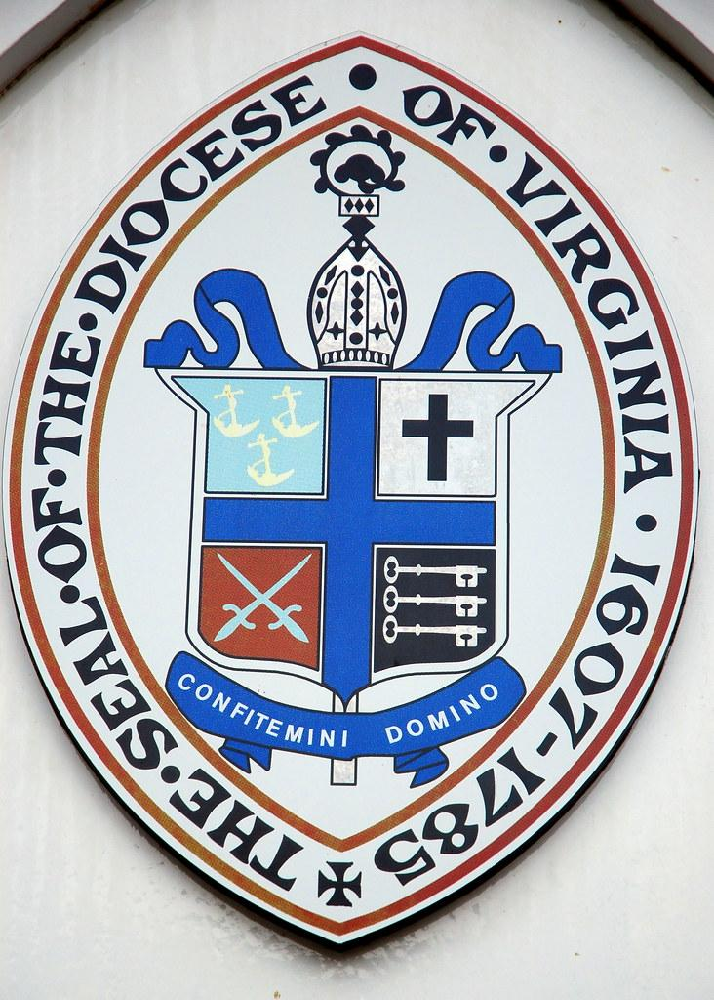

<section class="wrapper bg-light">
  

    

      

        <article class="card shadow-lg">
          

Full Communion

The [Episcopal](https://www.firstfamilies.us/faith/episcopalian) Church
is in Full Communion
with[ Lutheran ](https://www.firstfamilies.us/faith/lutheran)Church
through the [Porvoo
Communion](https://en.wikipedia.org/wiki/Porvoo_Communion).

The [Episcopal](https://www.firstfamilies.us/faith/episcopalian) Church
is in Full Communion with [Old
Catholics](https://www.firstfamilies.us/faith/old-catholics) through the [Bonn
Agreement](https://en.wikipedia.org/wiki/Bonn_Agreement_%28Christianity%29).

This National Council of Churches members  include
Evangelical [Lutheran ](https://www.firstfamilies.us/faith/lutheran)Church
in America,
American [Baptist](https://www.firstfamilies.us/faith/baptist) Churches
USA, [Moravian](https://www.firstfamilies.us/faith/moravians) Church in
America, Polish
National [Catholic](https://www.firstfamilies.us/faith/old-catholics) Church, [Presbyterian](https://www.firstfamilies.us/faith/presbyterians) Church
USA, [Friends United
Meeting](https://www.firstfamilies.us/faith/quakers),  [Philadelphia
Yearly Meeting,](https://www.firstfamilies.us/faith/quakers) [United
Church of
Christ](https://www.firstfamilies.us/faith/congregationalists), [Reformed
Church in America](https://www.firstfamilies.us/faith/dutch-reformed),
United [Methodist ](https://www.firstfamilies.us/faith/methodist)Church
and
the [Episcopal](https://www.firstfamilies.us/faith/episcopalian) Church
USA 

List of Historical Churches

[St. John's, Lafayette
Square](https://www.firstfamilies.us/events/washington-dc/national-christmas-tree#h.748kp66k4rxm) 

[Yeocomico
Church](https://www.firstfamilies.us/events/virginia/westmoreland#h.xafzrow38cft) 

[Historic Christ
Church](https://www.firstfamilies.us/events/virginia/lancaster-county#h.aaqod8rn3c0i) Lancaster
County Virginia

[St. Mary\'s White
Chapel](https://www.firstfamilies.us/events/virginia/lancaster-county#h.zh7l7j4s7awm) 

[St. Stephens
Episcopal](https://www.firstfamilies.us/events/virginia/northumberland#h.k37wxma3b3fc) 

[Manakin Episcopal
Church](https://www.firstfamilies.us/events/virginia/powhatan)

[Christ Episcopal
Church](https://www.firstfamilies.us/events/maryland/kent-island) of
Kent Island. Maryland oldest Christian congregation, 3rd oldest English
speaking Church in the entire Western Hemisphere! 

[Anglican Communion](https://en.wikipedia.org/wiki/Anglican_Communion)

The Anglican Communion is the third largest Christian communion after
the Roman Catholic and Eastern Orthodox churches. Formally founded in
1867 in London, the communion has more than 85 million members within
the Church of England and other autocephalous national and regional
churches in full communion. The traditional origins of Anglican doctrine
are summarised in the Thirty-nine Articles (1571). The archbishop of
Canterbury (as of 2024, Justin Welby) in England acts as a focus of
unity, recognised as primus inter pares (\"first among equals\"), but
does not exercise authority in Anglican provinces outside of the Church
of England. Most, but not all, member churches of the communion are the
historic national or regional Anglican churches.

[King Henry VIII](https://en.wikipedia.org/wiki/Henry_VIII)

(28 June 1491 -- 28 January 1547) was King of England from 22 April 1509
until his death in 1547. Henry is best known for his six marriages, and
his efforts to have his first marriage (to Catherine of Aragon)
annulled. His disagreement with Pope Clement VII about such an annulment
led Henry to initiate the English Reformation, separating the Church of
England from papal authority. He appointed himself Supreme Head of the
Church of England and dissolved convents and monasteries, for which he
was excommunicated by the pope.

King James Bible

Book of Common Prayer

The above Book of Common Prayer includes the original Catechism for the
Anglican (Episcopal) Church

{width="6.958333333333333in"
height="1.1780621172353456in"}

[Lay Preacher Training
Initiative](https://www.preachingfoundation.org/conferences-programs/lay-preaching-training-program/)

The [Lay Preacher Training
Initiative](https://www.preachingfoundation.org/conferences-programs/lay-preaching-training-program/) (LPTI)
of the [Episcopal Preaching
Foundation](https://www.preachingfoundation.org/) is completing a
two-year training pilot program funded by a three-year, \$400,000 grant
from Trinity Church Wall Street in New York City.  

[Download a
brochure](https://www.preachingfoundation.org/wp-content/uploads/Lay-Preacher-brochure-web.pdf) about
the program. 

 [Lay Leadership
Academy](https://americananglican.org/lay-leadership-academy/) 

The Lay Leadership Academy equips the saints for the work of ministry in
their congregations and communities as they engage the culture around
them. Its main conference, Formed, is held regionally across the
Anglican Church in North America to encourage lay people to engage our
culture around the full, four-chapter Gospel of creation, fall,
redemption, and restoration. In addition, videos for vestries and
chancellors equip those in these leadership roles to effectively lead in
their congregations and dioceses.  Our evangelism and renewal videos
equip all laity to transform their communities in mission for the
Kingdom of Christ. Search our resources below to find the support you
need to fulfill God's call on your life. 

{width="6.262202537182852in"
height="4.677083333333333in"}

Bruton Parish

When they were members of the Virginia House of Burgesses, men who would
lead the fight for independence and for creating a new  government
worshiped at Bruton. George Washington, Thomas Jefferson, and Patrick
Henry attended when the legislature was in  session. As emotions and
rhetoric heated during the years before the American Revolution, special
services took place at Bruton.  After the Stamp Act passed in 1765,
burgesses expressed their distress in a service at Bruton. The closing
of the port of Boston in  1774 touched off another protest when the
burgesses marched in solemn procession to the church for a Day of
Fasting, Humiliation, and Prayer.

Bruton Parish
Church  [Williamsburg](https://www.firstfamilies.us/events/virginia/virginia-beach),
VA 23187-3520. 757-229-2891.

{width="3.9479166666666665in"
height="2.21875in"}

[Yeocomico Church](https://www.copleparish.com/copy-of-history)

The history of Yeocomico Church begins in 1655 with an order of the
Northumberland County Court appointing the Vestry for the Yeocomico
Congregation: Mr Nicholas Jurnew, Jno Powell. and Church-Warden, Richard
Holden.  At that time, the congregation was in Chicacoan Parish of
Northumberland County.  In 1655, Virginia was in its third year under
the rule of Oliver Cromwell's Commonwealth of England.  The offices of
King, Lords, and Bishops had been abolished, and were not reestablished
until the Restoration of the King in 1660. Tradition says that the
building was erected in 1655.  If there were a vestry as noted in the
order, then there may have been a church of some variety.  The earliest
mention of a church building is in a patent (grant) of August 1, 1663,
on the Northwest Yeocomico granted to Luke Dyne and Thomas Beadles, in
which one of the landmarks is a Horse and foot path which goeth to
Yeocomico Church.\"  No deed to the church land has ever been located. 
Whatever church building there was would have been a Spartan affair.  
In 1664, that part of Northumberland was transferred into Westmoreland
County, and a new Parish called Cople was established.  The name came
from the Bedfordshire, England parish of the prominent Westmoreland
resident and Secretary of the Colony, Nicholas Spencer (1633-1689). 

1219 Old Yeocomico Rd, Kinsale, VA 22488

{width="6.054897200349957in"
height="5.208333333333333in"}

[Anglican Catholic Church](https://www.anglicancatholic.org/resources/) 

Our historical roots extend back to the Church of England, but our more
recent origins lie in the religious upheaval of the late-twentieth
century. Starting in the 1970s, a number of churches within the Anglican
communion began to question and renounce what we consider to be the
catholic and apostolic faith. This is why in 1977, an international
congress of nearly 2,000 Anglican clergy and lay people met in St.
Louis, Missouri, to take the actions necessary to establish an orthodox
jurisdiction in which traditional Anglicanism could be maintained.
Acting according to the principles determined in the Ecumenical Councils
of the ancient Church and adopting initially the name \"Anglican Church
of North America,\" they placed themselves under the jurisdiction of the
retired Episcopal bishop of Springfield, Illinois, the Right Reverend
Albert Chambers. In 1978 at a ceremony in Denver, Colorado, Bishop
Chambers expanded that jurisdiction and devolved it upon others by
consecrating four more bishops, and the Anglican Catholic Church was
born.  In decades since, the ACC has spread beyond its North American
homeland to most places where the English lanugage and Book of Common
Prayer had taken root, and even a few locations where they had not. 

{width="5.949729877515311in"
height="8.322916666666666in"}

[Episcopal Diocese of
Virginia](https://episcopalvirginia.org/resources/volunteers/lay-guidelines/)

**Lay Leader Guidelines and Licenses**

**Please note: **All of these ministries except for Eucharistic
Ministers who do not take the sacraments out of the church are required
to take some form of [**Safe Church misconduct prevention
training**](https://episcopalvirginia.org/resources/safechurch/).

- [**Lay Leader
  Guidelines**](https://episcopalvirginia.org/wp-content/uploads/2024/03/layleader_guidelines_rev_11-18.pdf)

*NOTE: Each of the following documents is a fillable form PDF file. In
order to complete the form on your computer, you must first save the
file on your computer. Once it is saved, you can open and complete the
form.*

- [**Catechist -- Information &
  Application**](https://episcopalvirginia.formstack.com/forms/catechist)

- [**Eucharistic Minister -- Information &
  Application**](https://episcopalvirginia.formstack.com/forms/eucharistic_minister)

- [**Eucharistic Visitor -- Information &
  Application**](https://episcopalvirginia.formstack.com/forms/eucharistic_visitor)

- [**Pastoral Leader --
  Information**](https://episcopalvirginia.org/wp-content/uploads/2024/03/lay_leader_pastoralleader_rev_11-18.pdf)

- [**Preacher -- Information &
  Application**](https://episcopalvirginia.formstack.com/forms/preacher)

- [**Worship Leader -- Information &
  Application**](https://episcopalvirginia.formstack.com/forms/worship_leader)

Licenses are not required for Lectors who read the Scriptures or for
Litanists who lead the Prayers of the People in worship.

          

        </article>
      

    

  

</section>
