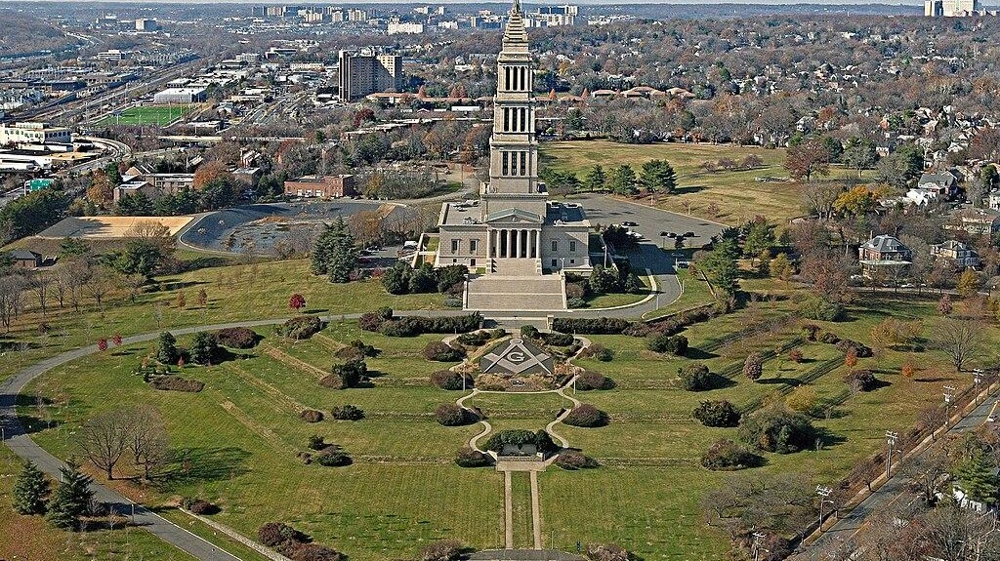
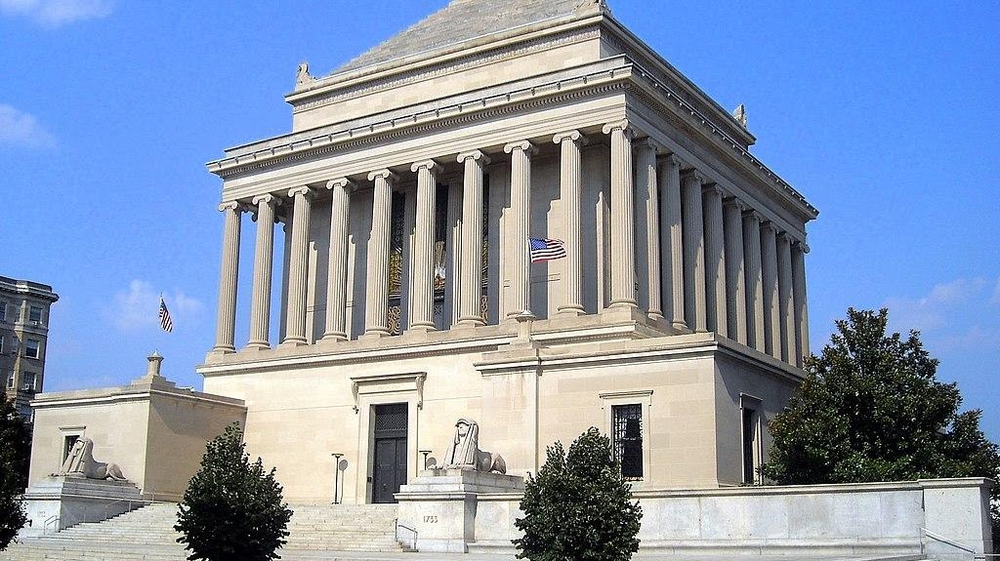

<section class="wrapper bg-light">
  

    

      

        <article class="card shadow-lg">
          

Freemasonry or Masonry refers to fraternal organisations that trace
their origins to the local guilds of stonemasons that, from the end of
the 14th century, regulated the qualifications of stonemasons and their
interaction with authorities and clients. Many Freemasons trace the
roots of the craft further back in history, accepting the Knights
Templar as the conduit between the ancient mysteries and the beginnings
of operative and speculative Freemasonry. Modern Freemasonry broadly
consists of two main recognition groups: Regular Freemasonry, which
insists that a volume of scripture be open in a working lodge, that
every member professes belief in a Supreme Being, that no women be
admitted, and that the discussion of religion and politics do not take
place within the lodge

Freemason Bible

{width="6.882318460192476in"
height="3.8645833333333335in"}

[George Washington Masonic National
Memorial](https://en.wikipedia.org/wiki/George_Washington_Masonic_National_Memorial)

The George Washington Masonic National Memorial is a Masonic building
and memorial located in Alexandria, Virginia, outside Washington, D.C.
It is dedicated to the memory of George Washington, the first president
of the United States and a Mason. The tower is fashioned after the
ancient Lighthouse of Ostia in Ostia Antica (or Rome). The 333-foot (101
m) tall memorial sits atop Shooter\'s Hill (also known as Shuter\'s
Hill) at 101 Callahan Drive. Construction began in 1922, the building
was dedicated in 1932, and the interior finally completed in 1970. In
July 2015, it was designated a National Historic Landmark for its
architecture, and as one of the largest-scale private memorials to honor
Washington

{width="6.864583333333333in"
height="3.85462489063867in"}

[House of the Temple](https://en.wikipedia.org/wiki/House_of_the_Temple)

The House of the Temple (officially, Home of The Supreme Council, 33°,
Ancient & Accepted Scottish Rite of Freemasonry, Southern Jurisdiction,
Washington D.C., U.S.A.) is a Masonic temple in Washington, D.C., United
States, that serves as the headquarters of the Scottish Rite of
Freemasonry, Southern Jurisdiction, U.S.A.

          

        </article>
      

    

  

</section>
