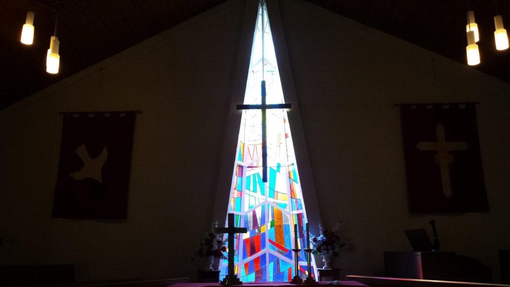
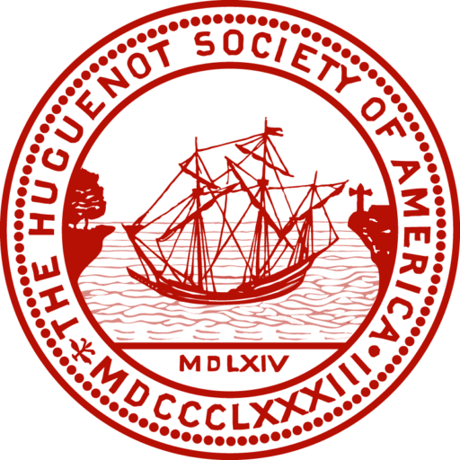
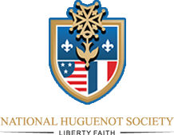

<section class="wrapper bg-light">
  

    

      

        <article class="card shadow-lg">
          

List of Historical Churches

[Huguenot Memorial Chapel and
Monument](https://www.firstfamilies.us/events/virginia/powhatan)

{width="6.031982720909887in"
height="8.302083333333334in"}

[John Calvin](https://en.wikipedia.org/wiki/John_Calvin)

10 July 1509 -- 27 May 1564) was a French theologian, pastor and
reformer in Geneva during the Protestant Reformation. He was a principal
figure in the development of the system of Christian theology later
called Calvinism, including its doctrines of predestination and of
God\'s absolute sovereignty in the salvation of the human soul from
death and eternal damnation. Calvinist doctrines were influenced by and
elaborated upon the Augustinian and other Christian traditions. Various
Congregational, Reformed and Presbyterian churches, which look to Calvin
as the chief expositor of their beliefs, have spread throughout the
world.

[Huguenot Memorial
Bridge](https://en.wikipedia.org/wiki/Huguenot_Memorial_Bridge)

The Huguenot Memorial Bridge was named in honor of the French Huguenot
settlers who came to the area in the 18th century to escape religious
persecution in France. It is owned by the Virginia Department of
Transportation (VDOT) and is the westernmost bridge over the James River
in the metropolitan Richmond area that is open to pedestrians.

{width="7.098707349081365in"
height="3.9895833333333335in"}

Huguenot UMC

10661 Duryea Dr Richmond, VA 23235-2106

Phone: 804-272-6820 Fax: 804 272-2517

​Email: huguenotumc@gmail.com

{width="5.333333333333333in"
height="5.333333333333333in"}

[Huguenot Society of
America](https://www.huguenotsocietyofamerica.org/history/ancestors/)

Applicants must be above the age of eighteen and a lineal descendant in
the male or female line of a Huguenot who emigrated from France, and
that such Huguenot émigré or one of his or her descendants in the same
line either settled in what is now the United States of America or left
France for countries other than America prior to the promulgation of the
Edict of Toleration on November 28, 1787. 

{width="2.2708333333333335in"
height="1.7604166666666667in"}

[National Huguenot
Society](https://nationalhuguenotsociety.org/ancestor-lookup/)

The objectives of The National Huguenot Society are patriotic,
religious, historical, and educational. Their design is to perpetuate
the memory, the spirit, and the deeds of the men and women in France
known as Huguenots who were persecuted in the 16th and 17th centuries
because of their adherence to the basic tenets of the Protestant faith
and their devotion to liberty, and who emigrated either directly or
through other countries to North America and contributed by their
character and ability to the development of the United States. 

French Confession of Faith

[Huguenot Memorial
Chapel](https://www.firstfamilies.us/events/virginia/powhatan)

          

        </article>
      

    

  

</section>
