[National Council of
Churches ](https://en.wikipedia.org/wiki/List_of_National_Council_of_Churches_members)

All NCC member organizations subscribe to the NCC\'s statement of faith,
which forms the preamble to the NCC\'s charter:

*\"The National Council of Churches is a community of Christian
communions, which, in response to the gospel as revealed in the
Scriptures, confess **Jesus Christ**, the incarnate Word of God, as
Savior and Lord. These communions covenant with one another to manifest
ever more fully the unity of the Church. Relying upon the transforming
power of the **Holy Spirit**, the communions come together as the
Council in common mission, serving in all creation to the glory
of **God**.\"*

List of National Council of Churches members: 
American [Baptist](https://www.firstfamilies.us/faith/baptist) Churches
USA;  [Episcopal](https://www.firstfamilies.us/faith/episcopalian) Church
in the United States of America;
Evangelical [Lutheran](https://www.firstfamilies.us/faith/lutheran) Church
in
America; [Moravian](https://www.firstfamilies.us/faith/moravians) Church
in
America;  [Presbyterian](https://www.firstfamilies.us/faith/presbyterians) Church
(USA);  [Reformed Church in
America](https://www.firstfamilies.us/faith/dutch-reformed);  [Friends](https://www.firstfamilies.us/faith/quakers) United
Meeting;  [Philadelphia Yearly
Meeting](https://www.firstfamilies.us/faith/quakers); [United Church of
Christ](https://www.firstfamilies.us/faith/congregationalists); 
United [Methodist](https://www.firstfamilies.us/faith/methodist) Church

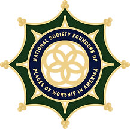{width="2.2604166666666665in"
height="2.25in"}

[National Society Founders of Places of Worship in
America ](https://www.nsfpwa.org/ancestors)

Membership is open to males and females of good moral character and
reputation, at least eighteen years of age, who can prove lineal descent
from a person who, in the timeframe prior to and including 1850 and
within the territory that became the forty-eight contiguous states of
the United States of America, contributed in one of the following
categories:

A founding signer of a Covenant, doctrine, named in town minutes or
referenced in historical documents as having met in faith or began a new
house of worship in any faith.

Held membership within first year of founding or meeting.

Donated land or monies which were used to build a meeting place/building
for worship.

Permitted property (land, home or building) to be used for the purposes
of holding worship.

Circuit Rider and mobile Ministries, in which clergy traveled to more
than one location to hold service.

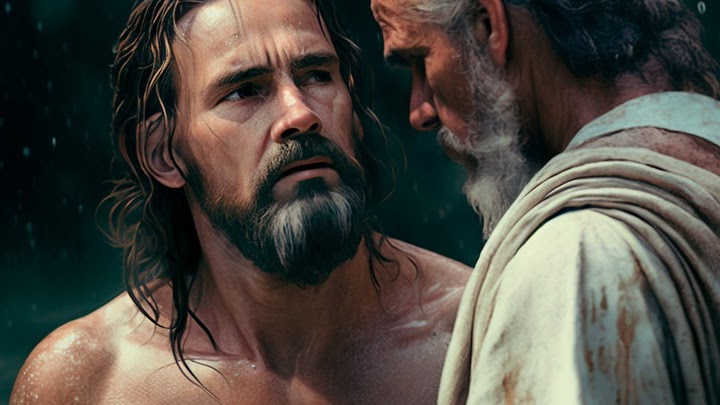

[Baptists](https://www.firstfamilies.us/faith/baptist)

    [ Baptist
Catechism](https://www.firstfamilies.us/faith/baptist)     

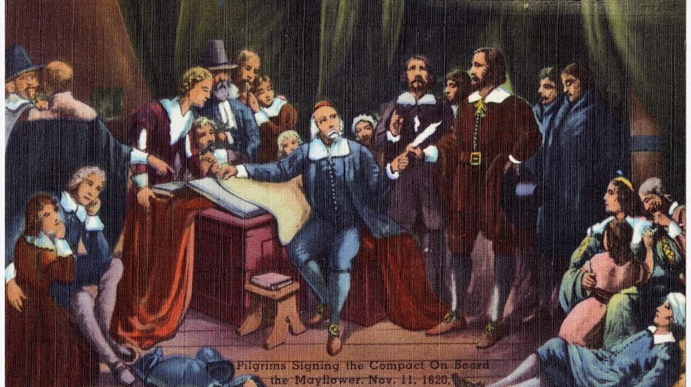{width="7.324987970253718in"
height="4.114583333333333in"}

[Congregationalism](https://www.firstfamilies.us/faith/congregationalists)

     [Smaller Westminster
Catechism](https://www.firstfamilies.us/faith/congregationalists)  
  [Geneva Bible](https://www.firstfamilies.us/faith/congregationalists)

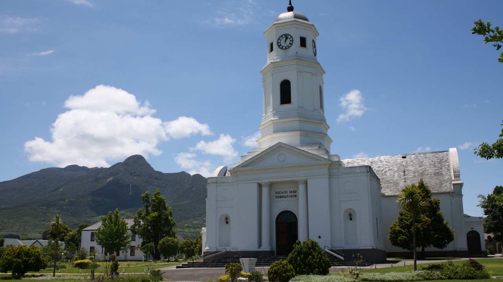{width="7.520833333333333in"
height="4.224593175853018in"}

[Dutch Reformed](https://www.firstfamilies.us/faith/dutch-reformed)

   [  Heildelberg Catechism 
  ](https://www.firstfamilies.us/faith/dutch-reformed) 

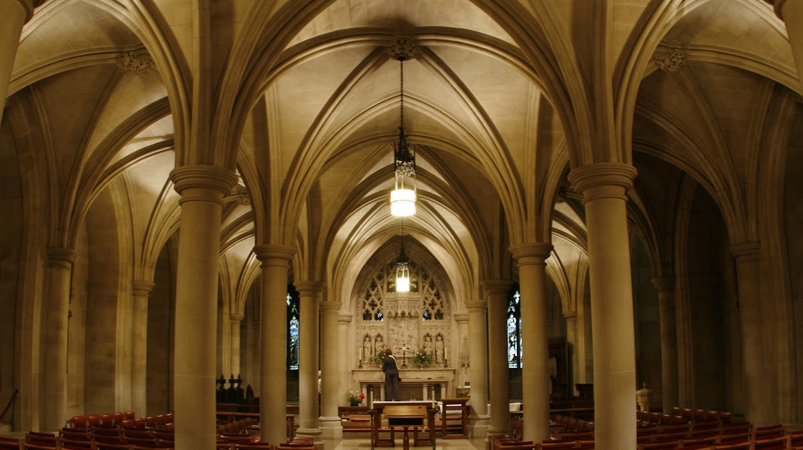{width="6.6663965441819775in"
height="3.744640201224847in"}

[Episcopalian](https://www.firstfamilies.us/faith/episcopalian)

Feel free to download the following books 

    [King James
Bible](https://www.firstfamilies.us/faith/episcopalian)     [Book of
Common Prayer 1662](https://www.firstfamilies.us/faith/episcopalian)  
  [Episcopalian
Catechism](https://www.firstfamilies.us/faith/episcopalian)

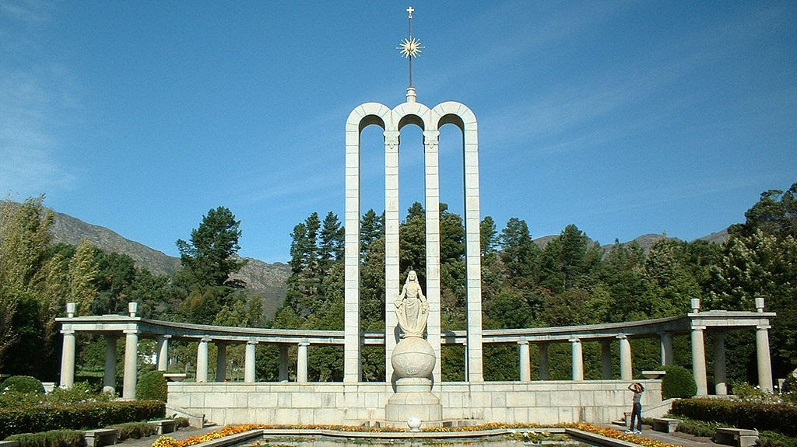{width="6.993623140857393in"
height="3.9270833333333335in"}

[Heguenots](https://www.firstfamilies.us/faith/heguenot) 

[Liturgy](https://quod.lib.umich.edu/cgi/t/text/text-idx?c=moa;idno=AJK3532). 

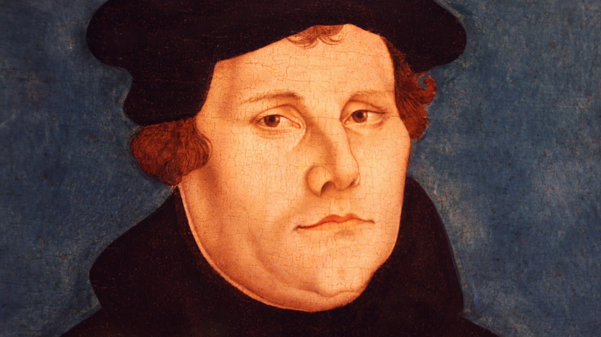{width="7.528975284339458in"
height="4.229166666666667in"}

[Lutheran](https://www.firstfamilies.us/faith/lutheran)

     [Luther\'s Small
Catechism](https://www.firstfamilies.us/faith/lutheran)     [Book of
Concord](https://www.firstfamilies.us/faith/lutheran)

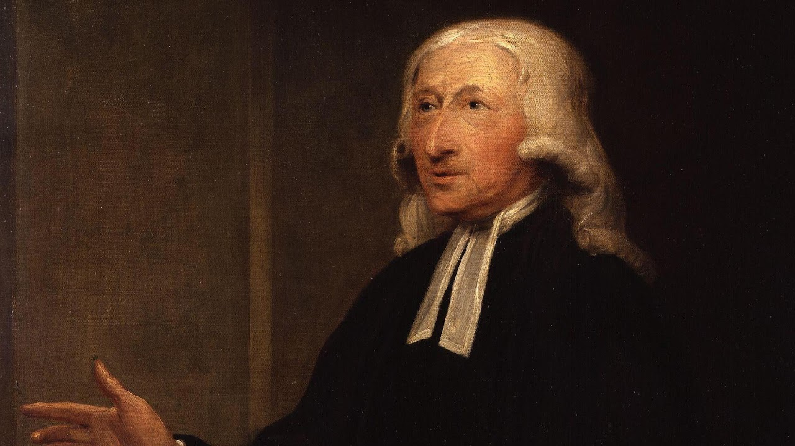{width="7.417709973753281in"
height="4.166666666666667in"}

[Methodist](https://www.firstfamilies.us/faith/methodist)

     [Methodist
Catechism](https://www.firstfamilies.us/faith/methodist)     [Book of
Discipline](https://www.firstfamilies.us/faith/methodist)

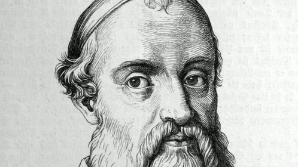{width="5.1875in"
height="2.9166666666666665in"}

[Mennonites](https://www.firstfamilies.us/faith/mennonites)

     [Elbing
Catechism](https://www.firstfamilies.us/faith/mennonites)     

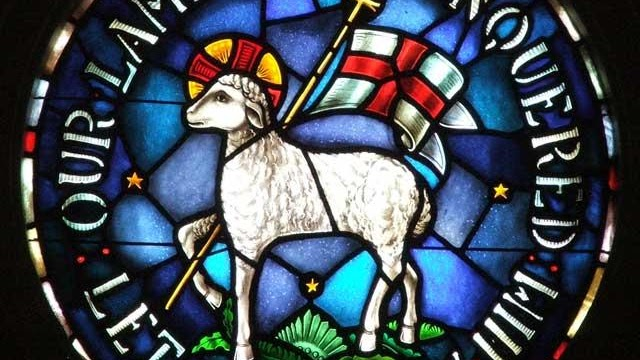{width="6.666666666666667in"
height="3.75in"}

Moravian Church

    [ Augsburg
Confession](https://www.firstfamilies.us/faith/lutheran)     [Luther\'s
Small Catechism](https://www.firstfamilies.us/faith/lutheran)  
  [Thirty-nine Articles of
Faith](https://www.firstfamilies.us/faith/episcopalian)     [Heidelberg
Catechism](https://www.firstfamilies.us/faith/dutch-reformed)     

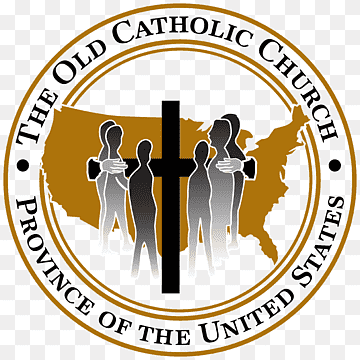

[Old Catholics](https://www.firstfamilies.us/faith/old-catholics)

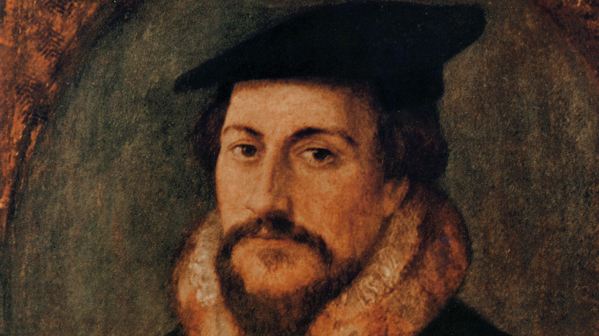{width="7.3125in"
height="4.107568897637795in"}

[Presbyterians](https://www.firstfamilies.us/faith/presbyterians)

    [ Large Westminster
Catechism](https://www.firstfamilies.us/faith/presbyterians)     [Book
of Confessions](https://www.firstfamilies.us/faith/presbyterians)

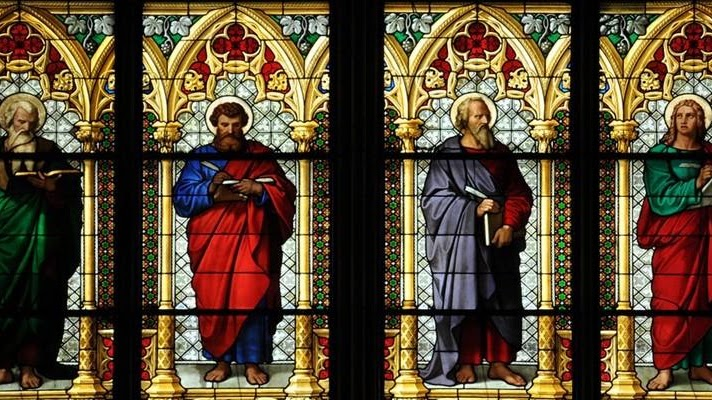{width="6.971666666666667in"
height="3.9166666666666665in"}

[National Society of
Saints](http://nationalsocietyofsaintsandsinners.org/wp-content/uploads/2018/07/Approved-List-of-Saints-07-15-15.pdf)

Welcome to the National Society of Saints and Sinners website.  We are
adding new information daily.  Please check back with us often, as we
enlarge our list of approved Saints.  Our first Council meeting on 14
April 2011, was a tremendous success. Several items of import to our
members were discussed and resolved. We extend a heartfelt thank you to
our members for helping us make the Society an even greater pleasure to
join.

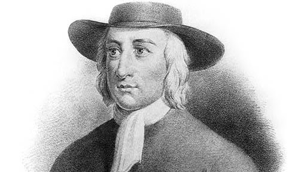

[Quakers](https://www.firstfamilies.us/faith/quakers)

     [Barclay Catechism](https://www.firstfamilies.us/faith/quakers)  
  [Faith and Practice](https://www.firstfamilies.us/faith/quakers)

*I believe in **God the Father**, who hath made me, and all the world.*

*     And in His only Son, **Jesus Christ**, who hath redeemed me, and
all mankind.*

*     And in the **Holy Spirit**, who sanctifies me, and all the Elect
people of God.*
