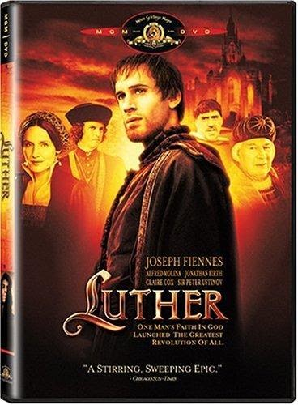
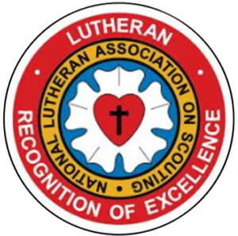
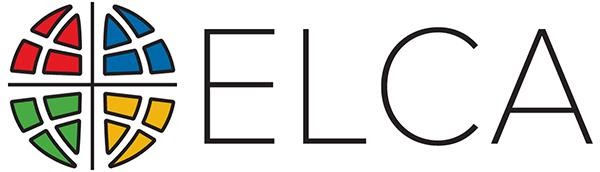

<section class="wrapper bg-light">

<article class="card shadow-lg">

- [Germmanna](http://germannafamily.org/index.php):

Ecumenical

This National Council of Churches members  include
Evangelical [Lutheran ](https://www.firstfamilies.us/faith/lutheran)Church
in America,
American [Baptist](https://www.firstfamilies.us/faith/baptist) Churches
USA, [Moravian](https://www.firstfamilies.us/faith/moravians) Church in
America, Polish
National [Catholic](https://www.firstfamilies.us/faith/old-catholics) Church, [Presbyterian](https://www.firstfamilies.us/faith/presbyterians) Church
USA, [Friends United
Meeting](https://www.firstfamilies.us/faith/quakers),  [Philadelphia
Yearly Meeting,](https://www.firstfamilies.us/faith/quakers) [United
Church of
Christ](https://www.firstfamilies.us/faith/congregationalists), [Reformed
Church in America](https://www.firstfamilies.us/faith/dutch-reformed),
United [Methodist ](https://www.firstfamilies.us/faith/methodist)Church
and
the [Episcopal](https://www.firstfamilies.us/faith/episcopalian) Church
USA 

List of Historical Lutheran Churches

[Zion Lutheran
Churc](https://www.firstfamilies.us/events/maryland/baltimore/german-christmas)h
Baltimore Maryland

Dr. Martin Luther

10 November 1483 -- 18 February 1546) was a German priest, theologian,
author, hymnwriter, professor, and Augustinian friar. He was the seminal
figure of the Protestant Reformation, and his theological beliefs form
the basis of Lutheranism.

Book of Concord

Luther\'s Small Catechism

Lutheran Scouting Association

[National Lutheran Association on Scouting](https://nlas.org/certreq/) provide resources for Lutheran
youth who are involved in the BSA, GSUSA or AHG organizations.

[Lay Schools for Ministry](https://www.elca.org/Our-Work/Leadership/Lay-Schools-for-Ministry)

The Lay Schools for Ministry program creates a communal and virtual
meeting place where life-long learning intentionally happens. Our task
is to promote and nourish this meeting place where all can share our
stories -- stories of multigenerational Christian and Lutheran families
dining together and sharing their long-day experiences at the fireplace
and stories of recent immigrant families rebuilding their lives in a new
place. In this communal and virtual place, we will also share the many
talents and gifts that the Spirit has given the church for the sake of
the world. Our goals are to develop and maintain avenues for life-long
learning, to create and share resources, and to sustain accountable
processes that help our denomination be a good and efficacious steward
of its mission and vocation. Our partners in [**Select
Learning**](https://www.selectlearning.org/) provide an avenue to access
and share current and future resources.  

[Lay Ministry Associates](https://mid-southlcms.org/church-worker/deacon-program/)

There is a recognized need to provide pastoral services to congregations
whose circumstances make it impossible for them to support the ministry
of a full-time, seminary trained pastor.  A program has been established
to place qualified laymen to serve in a congregation under the
supervision of an ordained pastor. This program is called "Lay Ministry
Associates" formerly called The Licensed Lay Deacon program.  

          

        </article>
      

    

  

</section>
