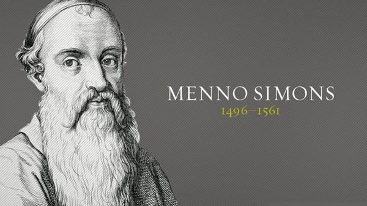

<section class="wrapper bg-light">
  

    

      

        <article class="card shadow-lg">
          

- [Swiss Anabaptist](https://saga-omii.org/index.html)

[Menno Simons](https://en.wikipedia.org/wiki/Mennonites)

Mennonites are groups of Anabaptist Christian church communities of
denominations. The name is derived from one of the early prominent
leaders of the Dutch Anabaptist movement, Menno Simons (1496--1561) of
Friesland. Through his writings about Reformed Christianity during the
Radical Reformation, Simons articulated and formalized the teachings of
earlier Swiss founders, with the early teachings of the Mennonites
founded on the belief in both the mission and ministry of Jesus, which
the original Anabaptist followers held with great conviction, despite
persecution by various Roman Catholic and Mainline Protestant states. 
The [Mennonite World Conference ](https://mwc-cmm.org/en)was founded at
the first conference in Basel, Switzerland, in 1925 to celebrate the
400th anniversary of Anabaptism

[Rumspringa](https://en.wikipedia.org/wiki/Rumspringa)

Rumspringa , is a rite of passage during adolescence, translated from
originally Palatine German and other Southwest German dialects to
English as \"jumping or hopping around\", used in some Amish
communities. The Amish, a subsect of the Anabaptist Christian movement,
intentionally segregate themselves from other communities as a part of
their faith. For Amish youth, the Rumspringa normally begins at age 16
and ends when a youth chooses either to be baptized in the Amish church
or to leave the community.  For Wenger Mennonites, Rumspringa occurs
mostly between ages of 17 and 21.

          

        </article>
      

    

  

</section>
