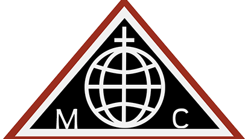
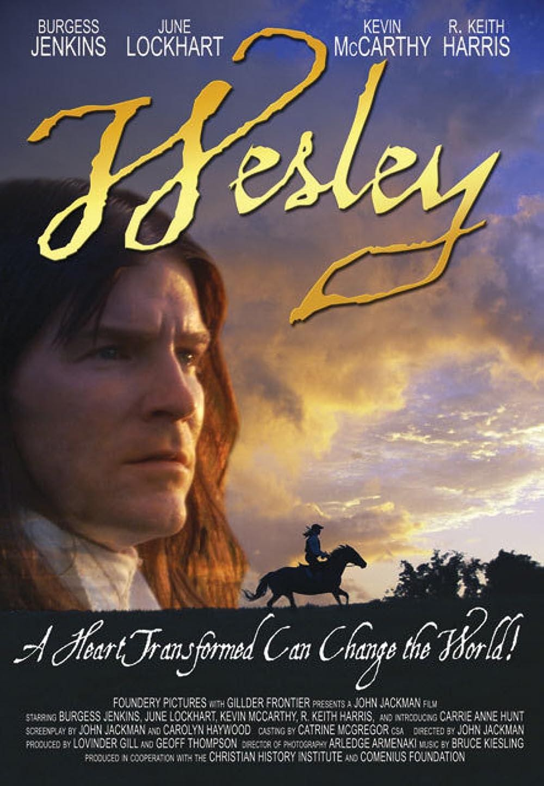
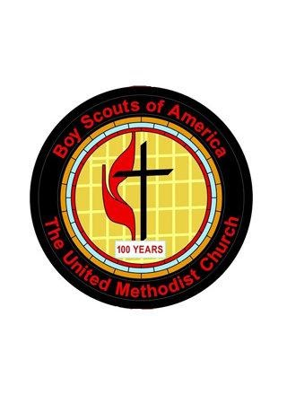

<section class="wrapper bg-light">
  

    

      

        <article class="card shadow-lg">
          

Ecumenical

This National Council of Churches members  include
Evangelical [Lutheran ](https://www.firstfamilies.us/faith/lutheran)Church
in America,
American [Baptist](https://www.firstfamilies.us/faith/baptist) Churches
USA, [Moravian](https://www.firstfamilies.us/faith/moravians) Church in
America, Polish
National [Catholic](https://www.firstfamilies.us/faith/old-catholics) Church, [Presbyterian](https://www.firstfamilies.us/faith/presbyterians) Church
USA, [Friends United
Meeting](https://www.firstfamilies.us/faith/quakers),  [Philadelphia
Yearly Meeting,](https://www.firstfamilies.us/faith/quakers) [United
Church of
Christ](https://www.firstfamilies.us/faith/congregationalists), [Reformed
Church in America](https://www.firstfamilies.us/faith/dutch-reformed),
United [Methodist ](https://www.firstfamilies.us/faith/methodist)Church
and
the [Episcopal](https://www.firstfamilies.us/faith/episcopalian) Church
USA 

[World Methodist
Council](https://en.wikipedia.org/wiki/World_Methodist_Council)

The World Methodist Council (WMC), founded in 1881, is a consultative
body and association of churches in the Methodist tradition. It
comprises 80 member denominations in 138 countries which together
represent an estimated 80 million people; this includes approximately 60
million committed members (of Methodist and united and uniting churches)
and a further 20 million adherents. But there is also another,
contradictory, number of members of the member churches on the WMC\'s
website: about 40 million. It is the fifth-largest Christian communion
after the Roman Catholic Church, Eastern Orthodox Church, Anglican
Communion, and World Communion of Reformed Churches

List of Historical Churches

[Strawbridge
Shrine](https://www.firstfamilies.us/events/maryland/carroll)

John Wesley

Aldersgate Day:  24 May 

On 24 May 1738 John Wesley experienced his \"heart strongly warmed.\"
This Aldersgate experience was crucial for his own life and became a
touchstone for the Wesleyan movement.

Methodist Catechism

Book of Discipline

{width="3.3333333333333335in"
height="4.583333333333333in"}

Methodist Scouting

[Scouting](https://www.gcumm.org/scouting) is a ministry of The United
Methodist Church. It puts caring adults and the church in contact with
youth in a structured, safe, and vetted program. Our relationship with
Scouting predates the forming of The United Methodist. Much has changed
since the Feb.12,1920 letter that first established the formal
relationship with BSA. Change has arrived again. The mission of the
church is to reach out to those within the community, receive them as
they are, relate them to God, nurture and equip them, and send them back
into the community in order to make the community a more loving and just
place in which to live. With that in mind, the United Methodist Men's
Foundation established an Office of Civic Youth-Serving
Agencies/Scouting Ministries. The purpose of this office is to promote
the use of programs across the Church and to help local congregations
understand how they might use civic youth-serving agencies as an
outreach ministry within their community.

          

        </article>
      

    

  

</section>
