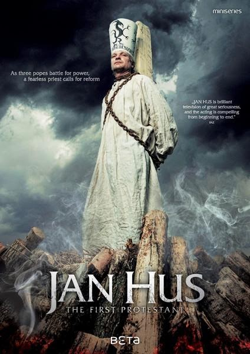

<section class="wrapper bg-light">
  

    

      

        <article class="card shadow-lg">
          

Ecumenical

This National Council of Churches members  include
Evangelical [Lutheran ](https://www.firstfamilies.us/faith/lutheran)Church
in America,
American [Baptist](https://www.firstfamilies.us/faith/baptist) Churches
USA, [Moravian](https://www.firstfamilies.us/faith/moravians) Church in
America, Polish
National [Catholic](https://www.firstfamilies.us/faith/old-catholics) Church, [Presbyterian](https://www.firstfamilies.us/faith/presbyterians) Church
USA, [Friends United
Meeting](https://www.firstfamilies.us/faith/quakers),  [Philadelphia
Yearly Meeting,](https://www.firstfamilies.us/faith/quakers) [United
Church of
Christ](https://www.firstfamilies.us/faith/congregationalists), [Reformed
Church in America](https://www.firstfamilies.us/faith/dutch-reformed),
United [Methodist ](https://www.firstfamilies.us/faith/methodist)Church
and
the [Episcopal](https://www.firstfamilies.us/faith/episcopalian) Church
USA .

Moravians accept
the [Lutheran](https://www.firstfamilies.us/faith/lutheran) Augsburg
Confession and
the [Anglican](https://www.firstfamilies.us/faith/episcopalian) 39
Articles of Religion

Historic Churches

[Graceham Moravian
Church ](https://www.gracehammoravian.org/new/index.php/about-us/your-template)in
Frederick County, Maryland

Jan Hus

Jan Hus (/hʊs/; Czech: c. 1370 -- 6 July 1415), sometimes anglicized as
John Hus or John Huss, and referred to in historical texts as Iohannes
Hus or Johannes Huss, was a Czech theologian and philosopher who became
a Church reformer and the inspiration of Hussitism, a key predecessor to
Protestantism, and a seminal figure in the Bohemian Reformation. Hus is
considered by some to be the first Church reformer, even though some
designate the theorist John Wycliffe. His teachings had a strong
influence, most immediately in the approval of a reformed Bohemian
religious denomination and, over a century later, on Martin Luther. Hus
was a master, dean and rector at the Charles University in Prague
between 1409 and 1410.

          

        </article>
      

    

  

</section>
