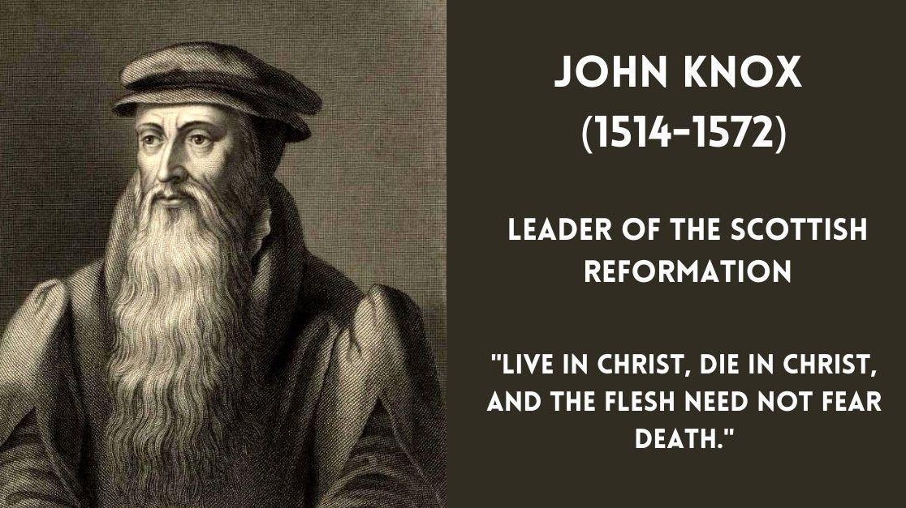
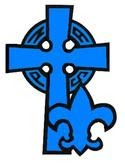

<section class="wrapper bg-light">
  

    

      

        <article class="card shadow-lg">
          

Ecumenical

This National Council of Churches members  include
Evangelical [Lutheran ](https://www.firstfamilies.us/faith/lutheran)Church
in America,
American [Baptist](https://www.firstfamilies.us/faith/baptist) Churches
USA, [Moravian](https://www.firstfamilies.us/faith/moravians) Church in
America, Polish
National [Catholic](https://www.firstfamilies.us/faith/old-catholics) Church, [Presbyterian](https://www.firstfamilies.us/faith/presbyterians) Church
USA, [Friends United
Meeting](https://www.firstfamilies.us/faith/quakers),  [Philadelphia
Yearly Meeting,](https://www.firstfamilies.us/faith/quakers) [United
Church of
Christ](https://www.firstfamilies.us/faith/congregationalists), [Reformed
Church in America](https://www.firstfamilies.us/faith/dutch-reformed),
United [Methodist ](https://www.firstfamilies.us/faith/methodist)Church
and
the [Episcopal](https://www.firstfamilies.us/faith/episcopalian) Church
USA 

[Westminster Savoy Philadelphia Confessions of
Faith](https://drive.google.com/file/d/1OcGjZowpmyAyw3Ma_dftxYKEd7bfAGh2/view?usp=sharing)

In [England](https://www.firstfamilies.us/ancestors/england) in 1646
the [Presbyterians](https://www.firstfamilies.us/faith/presbyterians) wrote
the [Westminster Confession of
Faith](https://drive.google.com/file/d/1OcGjZowpmyAyw3Ma_dftxYKEd7bfAGh2/view?usp=sharing). 
In 1658
the [Congregationalists](https://www.firstfamilies.us/faith/congregationalists) took
the [Westminster Confession of
Faith](https://drive.google.com/file/d/1OcGjZowpmyAyw3Ma_dftxYKEd7bfAGh2/view?usp=sharing) and
added \"Congregational governance\" and called it the [Savoy Declaration
of
Faith](https://drive.google.com/file/d/1OcGjZowpmyAyw3Ma_dftxYKEd7bfAGh2/view?usp=sharing). 
In 1689 the [Baptist](https://www.firstfamilies.us/faith/baptist) took
the [Savoy Declaration of
Faith](https://drive.google.com/file/d/1OcGjZowpmyAyw3Ma_dftxYKEd7bfAGh2/view?usp=sharing) and
added \"Believers Baptism\" and called it the [London Baptist Confession
of
Faith](https://drive.google.com/file/d/1OcGjZowpmyAyw3Ma_dftxYKEd7bfAGh2/view?usp=sharing).
In [Pennsylvania](https://www.firstfamilies.us/events/pennsylvania), in
1742 the  [Baptist](https://www.firstfamilies.us/faith/baptist)  took
the  [London Baptist Confession of
Faith](https://drive.google.com/file/d/1OcGjZowpmyAyw3Ma_dftxYKEd7bfAGh2/view?usp=sharing) and
added 2 more ordinances: \"Signing\" and the \"Laying on of Hands\" and
called it the [Philadelphia Confession of
Faith](https://drive.google.com/file/d/1OcGjZowpmyAyw3Ma_dftxYKEd7bfAGh2/view?usp=sharing).

List of Historical Churches

[Bullock Creek Presbyterian
Church](https://www.firstfamilies.us/events/south-carolina/carolina-piedmont)  
Sharon, SC

[John Knox](https://en.wikipedia.org/wiki/John_Knox)

John Knox (1514 -- 24 November 1572) was a Scottish minister, Reformed
theologian, and writer who was a leader of the country\'s Reformation.
He was the founder of the Presbyterian Church of Scotland.

Westminster Catechism

Book of Common Worship

Book of Confessions

{width="1.3020833333333333in"
height="1.7291666666666667in"}

[National Association of Presbyterian
Scouters](https://www.presbyterianscouters.org/membership.html)

To have SCOUTING at every level for all ages up to age 21 in every
Presbyterian Church; to have SCOUTING for all levels for the youth of
our Church and our community; to have our membership available to help
in the development of our youth in every congregation,
presbytery,synod,  and national faith organizations as well as in BSA.

          

        </article>
      

    

  

</section>
