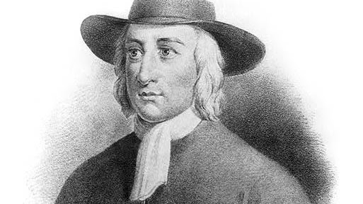
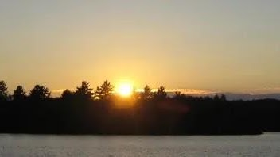
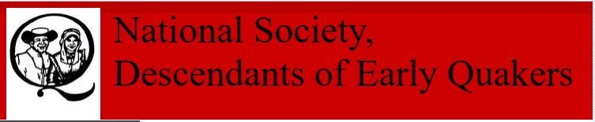

<section class="wrapper bg-light">

<article class="card shadow-lg">

- [Early Quaker Descendents](http://www.earlyquakers.org/qualifyingancestors.html), [Welcome Society](https://www.welcomesociety.org/ancestors.html), 

Ecumenical

This National Council of Churches members  include
Evangelical [Lutheran ](https://www.firstfamilies.us/faith/lutheran)Church
in America,
American [Baptist](https://www.firstfamilies.us/faith/baptist) Churches
USA, [Moravian](https://www.firstfamilies.us/faith/moravians) Church in
America, Polish
National [Catholic](https://www.firstfamilies.us/faith/old-catholics) Church, [Presbyterian](https://www.firstfamilies.us/faith/presbyterians) Church
USA, [Friends United
Meeting](https://www.firstfamilies.us/faith/quakers),  [Philadelphia
Yearly Meeting,](https://www.firstfamilies.us/faith/quakers) [United
Church of
Christ](https://www.firstfamilies.us/faith/congregationalists), [Reformed
Church in America](https://www.firstfamilies.us/faith/dutch-reformed),
United [Methodist ](https://www.firstfamilies.us/faith/methodist)Church
and
the [Episcopal](https://www.firstfamilies.us/faith/episcopalian) Church
USA 

List of Historical Churches:

[Chester Friends
Meetinghouse](https://www.firstfamilies.us/events/pennsylvania/delaware) 
520 East 24th Street in Chester, Delaware County, Pennsylvania, United
States

[Hopewell Friends Meeting
House](https://www.firstfamilies.us/events/virginia/winchester-frederick) 604
Hopewell Road, Clear Brook, VA 22624

[Springfield Friends
Meeting](https://www.firstfamilies.us/events/north-carolina/piedmont-triad) High
Point North Carolina

[Cane Creek Friends
Meeting](https://www.firstfamilies.us/events/north-carolina/alamance) 
719 W Greensboro Chapel Hill Rd, Snow Camp, NC, United States, 27349

[Deep River Friends
Meeting ](https://www.firstfamilies.us/events/north-carolina/piedmont-triad)5300
West Wendover Avenue High Point, NC 27265

[New Garden Friends
Meeting](https://www.firstfamilies.us/events/north-carolina/piedmont-triad) 801
New Garden Road Greensboro, N.C. 27410

[Third Haven Friends Meeting](https://thirdhaven.org/) (Quaker)  405 S.
Washington St., Easton, MD 21601; (410) 822-0293 

George Fox

Commemoration Day: 13 January 

Renewer of Society 1691

Barclay Catechism

Faith and Practice

Friends Committee on Scouting

[Friends Committee on Scouting](https://quakerscouting.org/join-fcs/) serves to encourage and
promote the faith, history, and testimonies of the Religious Society of
Friends (Quakers) through religious education programs for Quaker
Scouts/Guides. 

[Early Quaker Descendants](http://www.earlyquakers.org/qualifyingancestors.html)

Men, Women and children who establish descent, either lineal or
collateral, from an early member of the Society of Friends (1835 or
before), throughout the world, shall be eligible for membership. Junior
members are eligible from birth to age 25 years. 

</article>

</section>
