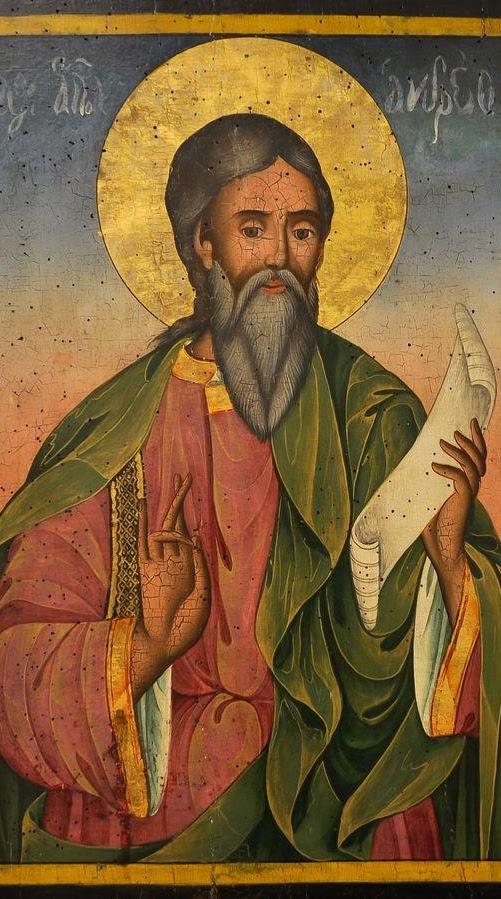
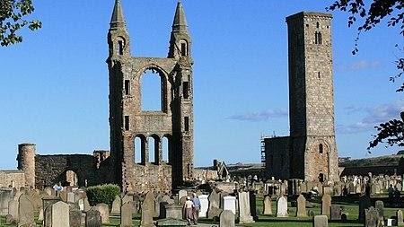

{width="5.21875in"
height="9.364583333333334in"}

[St. Andrew\'s Day](https://catholicsaintmedals.com/saints/st-andrew/)

St. Andrew, who was Simon Peter's brother, first appears in the New
Testament as a Galilean fisherman from the village of Bethsaida. He
introduces Simon Peter to Jesus who in turn calls them to be "fishers of
men."

As one of Jesus' disciples, St. Andrew figures prominently in the New
Testament Gospels. Throughout church history, scholars have cited his
preaching throughout the regions of Romania, Russia, the Ukraine,
Scotland and Greece. Andrew was known to have great social skills with a
great gift of bringing many people to Jesus.

The canonization date of St. Andrew is unknown. The church celebrates
his Feast Day on November 30. In addition to being the patron saint of
several European countries, St. Andrew is also the patron saint of
fishermen and unmarried women. Because of his social skills, St. Andrew
is considered the patron saint of social networking as well.

Feast Day is 30 November

{width="4.6875in"
height="2.6354166666666665in"}

[St Andrews
Cathedral](https://en.wikipedia.org/wiki/St_Andrews_Cathedral)

The Cathedral of St Andrew is a ruined cathedral in St Andrews, Fife,
Scotland.  
The [Kenner](https://www.firstfamilies.us/ancestors/scotland/kenner) family
gave a carucate of land of Cathelai to the church of St. Andrews.  King
Malcolm IV, and King William confirmed the grant of Chathelach, with
common pasture for twenty-four beasts, and eighty sheep.
