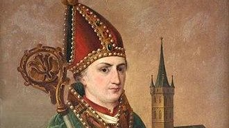

<section class="wrapper bg-light">

<article class="card shadow-lg">

[St. Ansgar](https://en.wikipedia.org/wiki/Ansgar)

Ansgar (8 September 801 -- 3 February 865), also known as Anskar,\[3\]
Saint Ansgar, Saint Anschar or Oscar, was Archbishop of Hamburg-Bremen
in the northern part of the Kingdom of the East Franks. Ansgar became
known as the \"Apostle of the North\" because of his travels and the See
of Hamburg received the missionary mandate to bring Christianity to
Northern Europe
