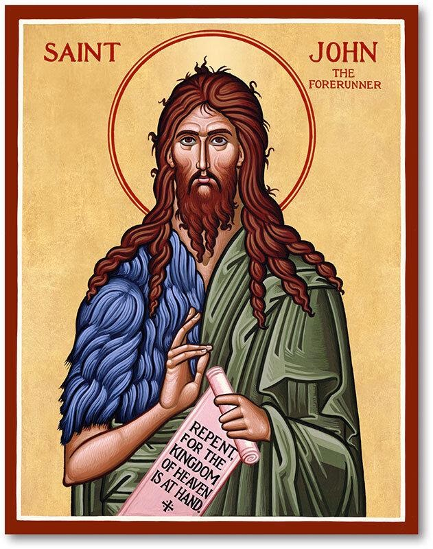

{width="6.572916666666667in"
height="8.333333333333334in"}

St. John the Baptist

Saint John the Baptist is remembered as a prophet, the forerunner of
Christ and the man who baptized Jesus. He was known for calling people
to turn away from sin, and first recognizing Jesus for who he was.
Scholars believe that Saint John was born approximately six months
before the birth of Christ.

The saint lived as a hermit for many years in the desert of Judea. He
began to publicly breach on the banks of the Jordan River at the age of
30. He educated large crowds in regards to the need for baptism and
forgiveness to redeem one's sins. One day while baptizing and preaching
John encountered Jesus who came to be Baptized. John at first refused
saying he was unworthy but relented. Following the Baptism of Jesus by
John a voice was heard from the heavens proclaiming "this is my beloved
son in whom I am well pleased." John was beheaded, and his head was
given by Herod as a reward for the dancing of Salome.

The Feast Day of John the Baptist is celebrated on June 24.
