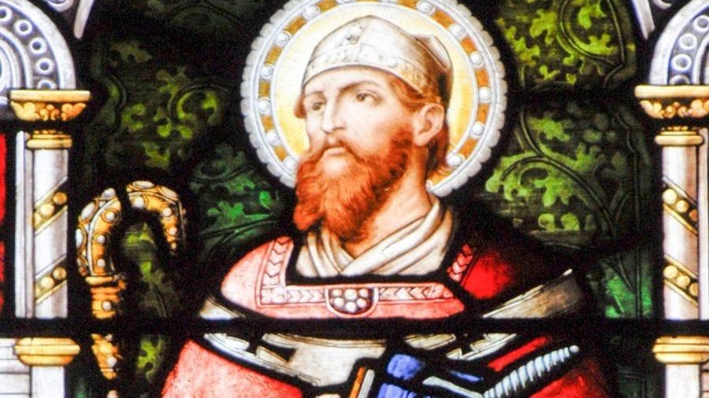

<section class="wrapper bg-light">

<article class="card shadow-lg">

Saint Boniface

St. Boniface was an English Benedictine monk and leading figure in the
Anglo-Saxon mission to the Germanic parts of Francia during the eighth
century. He organised significant foundations of the church in Germany
and was made bishop of Mainz by Pope Gregory III. He was martyred in
Frisia in 754, along with 52 others, and his remains were returned to
Fulda, where they rest in a sarcophagus which remains a site of
Christian pilgrimage.

Boniface\'s life and death as well as his work became widely known,
there being a wealth of material available --- a number of vitae,
especially the near-contemporary Vita Bonifatii auctore Willibaldi,
legal documents, possibly some sermons, and above all his
correspondence. He is venerated as a saint in the Christian church and
became the patron saint of Germania, known as the \"Apostle to the
Germans\".
