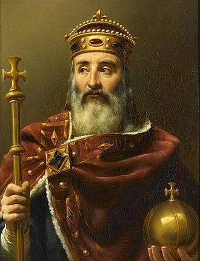

<section class="wrapper bg-light">

<article class="card shadow-lg">

[Famous Descendants](https://famouskin.com/famous-kin-menu.php?name=4143+charlemagne)

For a list of famous descendants of Charlemagne:
<https://famouskin.com/famous-kin-menu.php?name=4143+charlemagne>

[Order of the Crown of Charlemagne](https://www.charlemagne.org/Gateway.html)

Historical and genealogical research and to perpetuate the memory and to
honor the name of Emperor Charlemagne; to bring into one group the
descendants of his successors and heirs; to maintain and promote the
traditions of chivalry and knighthood; to recognize acts of merit; to
recognize achievements in the Arts, Sciences and Letters; to inspire
patriotism and loyalty to our country; and for such other lawful and
proper purposes as the Executive Council of the order may from time to
time decide upon. To collect and preserve books on genealogy, family
history, heraldry and general history. To collect and preserve
documents, manuscripts, relics, records and traditions relating to
Emperor Charlemagne and his successors; to create a popular interest in
ancient history and genealogy. The Order is non-political and
non-sectarian.

The Order meets once a year in Washington, DC at a \"black
tie\" [dinner](https://www.charlemagne.org/dinner.html) event the second
Thursday of April.

[Feast Day](https://www.traditioninaction.org/History/A02CharlemagneTribute.html)

Charlemagne was revered as a saint in the Holy Roman Empire and some
other locations after the twelfth century. The Apostolic See did not
recognise his invalid canonisation by Antipope Paschal III, done to gain
the favour of Frederick Barbarossa in 1165. The Apostolic See annulled
all of Paschal\'s ordinances at the Third Lateran Council in 1179. He is
not enumerated among the 28 saints named \"Charles\" in the Roman
Martyrology. His beatification has been acknowledged as cultus confirmed
and is celebrated on 28 January.

\"Hail, o Charles, beloved of God, Apostle of Christ, defender of His
Church, protector of justice, guardian of good customs, terror of the
enemies of the Christian name!

\"The tainted diadem of the Caesars - purified by the hands of Leo -
sits on your august forehead; the globe of the Empire rests in your
vigorous hand; the ever-victorious sword in your combats for Our Lord is
sheathed at your waist, and on your forehead the imperial anointing was
added to the royal unction by the hand of the Pontiff who consecrated
you and confirmed your authority. As the representative of the figure of
Christ in His temporal Royalty, you desired that He would reign in you
and through you.

\"Now God rewards you for the love you had for Him, for the zeal you
displayed for His glory, for the respect and confidence you showed
toward His Spouse. In exchange for an earthly kingship, transitory and
uncertain, you enjoy now an immortal kingdom where so many million of
souls, who by your hands escaped idolatry, today honor you as the
instrument of their salvation.

\"During the days of celebration of the birth of Our Lord by Our Lady,
you offered to them the gracious temple you built in their honor (the
Basilica of Aix-la-Chapelle), and which is still today the object of our
admiration. It was in this place that your pious hands placed the
newborn garment worn by her Divine Son. As retribution, the Son of God
desired that your bones should gloriously rest in the same place to
receive the testimony of the veneration of the peoples.

\"O glorious heir to the three Magi Kings of the East, present our souls
before the One who wore such a humble garment. Ask Him to give us a part
of the profound humility you had as you knelt before the Manger, a part
of that great joy that filled your heart at Christmas, a part of that
fiery zeal that made you realize so many works for the glory of the
Infant Christ, and a part of that great strength that never abandoned
you in your conquests for His Kingdom.

\"O mighty Emperor, you who of old was the arbiter of the whole European
family assembled under your scepter, have mercy on this society that
today is being destroyed in all its parts. After more than a thousand
years, the Empire that the Church placed in your hands has collapsed as
a chastisement for its infidelity to the Church that founded it. The
nations still remain, troubled and afflicted. Only the Church can return
life to them through the Faith; only she continues to be the depositary
of public law; only she can govern the powerful and bless the obedient.

\"O Charles the Great, we beseech you to make that day arrive soon when
society, re-established at its foundations, will cease asking liberty
and order from the revolutions. Protect with a special love France, the
most splendid flower of your magnificent crown. Show that you are always
her king and father. Put an end to the false progress of the faithless
empires of the North that have fallen into schism and heresy, and do not
permit the peoples of the Holy Empire to fall prisoner to them.\"
