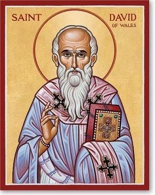
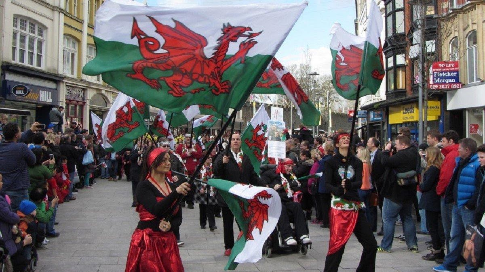

{width="3.3125in"
height="4.166666666666667in"}

[St. David](https://catholicsaintmedals.com/saints/st-david/)

During the 6th century, St. David was responsible for forming several
monasteries, in particular his abbey in Wales. This abbey was known for
hard, physical labor while working in silence. The development of a
joyous spirit was emphasized as they worked in silence, surviving only
on bread, water, and the vegetables they grew. Even on his death-bed, he
encouraged his monks to remain joyful in the Lord, no matter what their
physical state in life.

St. David is considered the patron saint of Wales and poets. He is
depicted most often with a dove sitting upon his shoulder. This picture
represents the legend that a dove landed while he was speaking as the
ground. As the dove pulled him up, the ground beneath him elevated him
above the crowd so that he could be heard by everyone in attendance.

Feast Day is 1 March

St. Davids Day

1 March

[The Welsh Society of
Philadelphia](https://www.firstfamilies.us/events/pennsylvania/philadelphia)

[The Welsh Society of
Philadelphia](https://www.facebook.com/PhiladelphiaWelsh?__tn__=-UC*F)

The Welsh Society of Philadelphia has members that have a wide range of
ages and interests. Everyone who shares our interest in keeping current
with local Welsh American events is most welcome. Membership of the
Welsh Society of Philadelphia provides the following opportunities:

A chance to participate in the historic and vibrant Welsh American
community

Enjoy a variety of social and heritage events

Singing and community spirit at the Gymanfa Ganu

Receive notifications of upcoming events

Recognize outstanding Welsh Americans through the Robert Morris Award 
