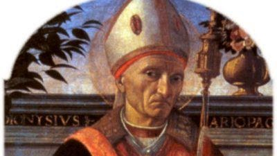

{width="4.166666666666667in"
height="2.34375in"}

St. Dennis

Denis of Paris was a 3rd-century Christian martyr and saint. According
to his hagiographies, he was bishop of Paris (then Lutetia) in the third
century and, together with his companions Rusticus and Eleutherius, was
martyred for his faith by decapitation. Some accounts placed this during
Domitian\'s persecution and incorrectly identified St Denis of Paris
with the Areopagite who was converted by Paul the Apostle and who served
as the first bishop of Athens. Assuming Denis\'s historicity, it is now
considered more likely that he suffered under the persecution of the
emperor Decius shortly after AD 250. Denis is the most famous
cephalophore in Christian history, with a popular story claiming that
the decapitated bishop picked up his head and walked several miles while
preaching a sermon on repentance. He is venerated in the Catholic Church
as the patron saint of France and Paris and is accounted one of the
Fourteen Holy Helpers. A chapel was raised at the site of his burial by
a local Christian woman; it was later expanded into an abbey and
basilica, around which grew up the French city of Saint-Denis, now a
suburb of Paris
