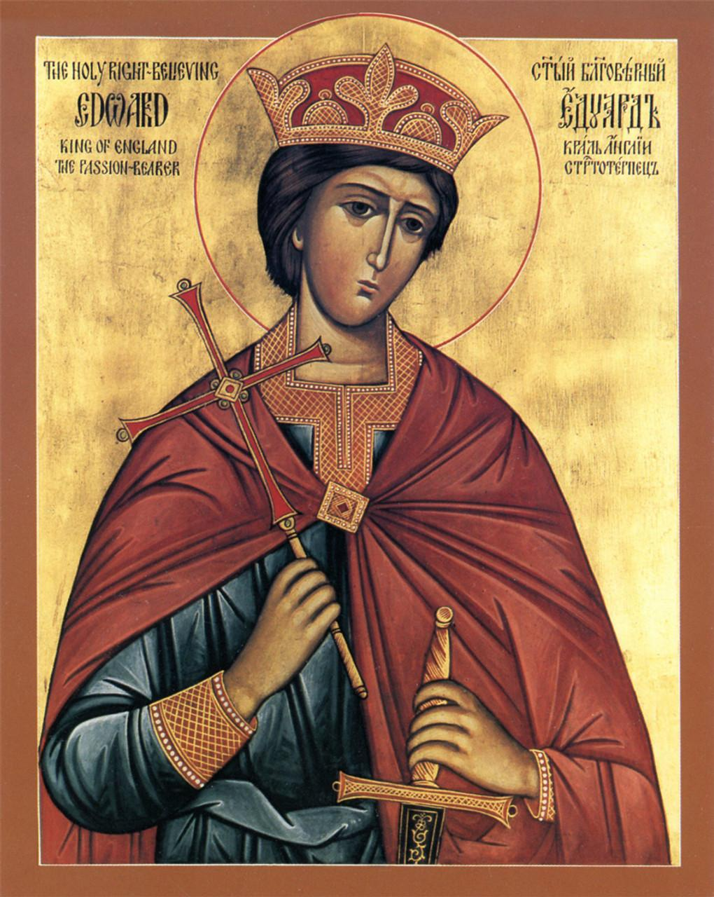

<section class="wrapper bg-light">

<article class="card shadow-lg">

[King Edward of Wessex](https://catholicsaints.info/saint-edgar-the-peaceful/)

Born a prince, the son of King Edmund I and Saint Elgiva of Shaftesbury.
King of the Mercians and Northumbrians in 957. King of the West Saxons
on 1 October 959, which effectively made him king of all England.
Efficient and unusually tolerant of local customs; while he spent much
time in military actions, his reign was a peaceful period for civilians.
Supported his friend Saint Dunstan, Archbishop of Canterbury, Archbishop
Oswald of York, and Bishop Aethelwold of Winchester in founding abbeys,
encouraged the Benedictine movement, and enacted penalties for
nonpayment of tithes and Peter's pence. Father of Saint Edward the
Martyr.

Feast Day 8 July

