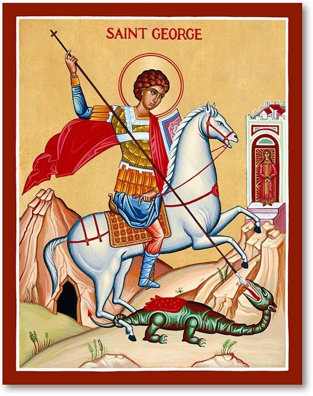
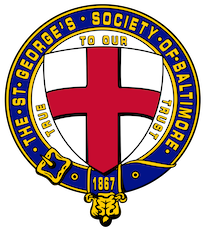

<section class="wrapper bg-light">

<article class="card shadow-lg">

[St. George](https://catholicsaintmedals.com/saints/st-george/)

The patron saint of soldiers and boy scouts, St. George generally is
depicted slaying a dragon while rescuing a damsel. Patron saint of
England and Catalonia, his feast day is April 23. A soldier under Roman
Emperor Diocletian, George found favor for his bravery even though
Diocletian was a pagan bitterly opposed to Christianity.

While his actual acts have been debated, there's no doubt he lived. He
is believed to have been from a noble family in Lydda, Palestine and
born between 275 and 285.

George stepped up for persecuted Christians under Diocletian. Arrested
by Diocletian in an army purge in 302, George went from being one of the
emperor's favorites to an outcast. He was tortured and beheaded in 303.
Even dying, George declared his love for God. Those declarations of
faith became legendary and he soon became an honored as one of the key
martyrs in Christian history.

Feast Day 23 April

[St. George\'s Society of
Baltimore](https://www.stgeorgesbalt.org/events)

The St. George\'s Society of Baltimore is a philanthropic and social
organization founded in 1867 to afford relief and advice to the indigent
natives of England and Wales and the British Colonies or to their wives,
widows and children; and to promote social intercourse amongst its
members. In recent years, through its 501(c)(3) Foundation, The St.
George\'s Society of Baltimore has supported the Invictus Games
Foundation, Help For Heroes, the Royal British Legion, and Prince\'s
Trust USA, as well as providing hospitality to officers and ship\'s
company of visiting Royal Navy ships. The Society also sponsors several
events celebrating British culture and history annually to promote
fellowship amongst its members and hospitality for their families,
friends and guests.
