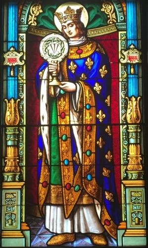
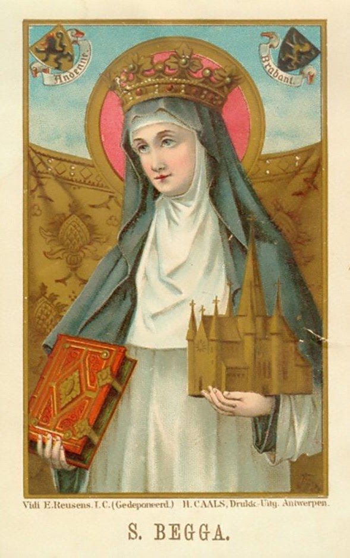
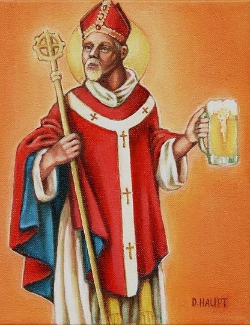
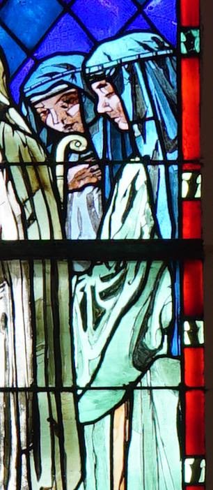

<section class="wrapper bg-light">

<article class="card shadow-lg">

The Saints 

\"*We teach that the memory of saints may be set before us, that we may
follow their faith and good works, according to our calling, as the
Emperor may follow the example of David in making war to drive away the
Turk from his country. *\"  Dr.
Martin [Luther](https://www.firstfamilies.us/faith/lutheran)

[National Society of
Saints](http://nationalsocietyofsaintsandsinners.org/wp-content/uploads/2018/07/Approved-List-of-Saints-07-15-15.pdf)

Welcome to the National Society of Saints and Sinners website.  We are
adding new information daily.  Please check back with us often, as we
enlarge our list of approved Saints.  Our first Council meeting on 14
April 2011, was a tremendous success. Several items of import to our
members were discussed and resolved. We extend a heartfelt thank you to
our members for helping us make the Society an even greater pleasure to
join.

[Louis Capet](http://catholicsaints.info/saint-louis-ix/)

Son of King Louis VIII and Blanche of Castile. King of France and Count
of Artois at age eleven; his mother ruled as regent until he reached 22,
and then he reigned for 44 years. Louis made numerous judicial and
legislative reforms, promoted Christianity in France, established
religious foundations, aided mendicant orders, propagated synodal
decrees of the Church, built leper hospitals, and collected relics.
Married Marguerite of Provence at age 19, and was the father of eleven
children. Supported Pope Innocent IV in war against Emperor Frederick II
of Germany. Trinitarian tertiary. Led two Crusades and died on one.

Feast Day is 25 August

[King Edward of
Wessex](https://catholicsaints.info/saint-edgar-the-peaceful/)

Born a prince, the son of King Edmund I and Saint Elgiva of Shaftesbury.
King of the Mercians and Northumbrians in 957. King of the West Saxons
on 1 October 959, which effectively made him king of all England.
Efficient and unusually tolerant of local customs; while he spent much
time in military actions, his reign was a peaceful period for civilians.
Supported his friend Saint Dunstan, Archbishop of Canterbury, Archbishop
Oswald of York, and Bishop Aethelwold of Winchester in founding abbeys,
encouraged the Benedictine movement, and enacted penalties for
nonpayment of tithes and Peter's pence. Father of Saint Edward the
Martyr.

Feast Day 8 July

[Begga](https://en.wikipedia.org/wiki/Begga)

Some hold that the Beguine movement which came to light in the 12th
century was actually founded by St Begga; and the church in the
beguinage of Lier, Belgium, has a statue of St Begga standing above the
inscription: St. Begga, our foundress. The Lier beguinage dates from the
13th century.

Another popular theory, however, claims that the Beguines derived their
name from that of the priest Lambert le Bègue, under whose protection
the witness and ministry of the Beguines flourished.

She is commemorated on 17 December.

Bishop [Arnulf
Arnulfing](https://catholicsaints.info/saints-of-the-day-arnulf-arnoul-arnold-of-metz/)

Arnulf was a courtier of the Austrasian King Theodebert II, a valiant
warrior, and a valued adviser. He married the noble Doda (the marriage
of his son Ansegisel to Begga, daughter of Blessed Pepin of Landen,
produced the Carolingian line of kings of France).

Arnulf desired to become a monk at Lérins. However, when his wife took
the veil and Arnulf was at the point of entering Lérins, he was
appointed bishop of Metz about 610. He played a prominent role in
affairs of state, was one of those instrumental in making Clotaire of
Neustria king of Austrasia, and was chief counselor to Dagobert, son of
King Clotaire, when the king appointed him king of Austrasia.

About 626, Arnulf resigned his see and retired to a hermitage near the
abbey of Remiremont (Benedictines, Delaney, Encyclopedia).

In art, Saint Arnulf is portrayed as a bishop with a coat of mail under
his cope. He may also be shown  with a fish having a ring in its mouth; 
blessing a burning castle; or  washing the feet of the poor (Roeder). He
is venerated at Remiremont. Like Saint Antony, Arnulf is invoked to find
lost articles. He is also the patron saint of music, millers, and
brewers (Roeder).

Feast Day is 18 July

[Doda of Reims](https://en.wikipedia.org/wiki/Doda_of_Reims)

Saint Dode (born before 509) was an Abbess of Saint Pierre de Reims and
a French Saint. She is reputed to be the daughter of Chloderic, King of
the Ripuarian Franks and the sister of Munderic, making her a princess
of the Ripuarian Franks.

Doda lived in Reims in the 6th century, she was the second abbess of
Saint-Pierre-les-Dames in Reims. There is some confusion regarding her
parentage.

Flodoard, in his Historia ecclesiæ Remensis says she was a niece of
Balderic, Abbot of Montfaucon and Beuve, founders of the Abbey of
Saint-Pierre-les-Dames de Reims and children of a king Sigebert.
Flodoard identifies this king as Sigebert I (c. 535 -- c. 575), king of
Austrasia, when perhaps it is, in fact, Sigobert the Lame (died c. 509),
king of Cologne. Although Doda is reputed to be the daughter of
Sigobert\'s son Chlodoric, chronologically, it seems difficult to make
of Doda a daughter of Chlodéric. She would more likely be Sigobert the
Lame\'s granddaughter, the daughter of a younger sister of Chloderic,
born some time shortly before their father\'s death.

Doda is raised by her aunt, Beuve. Later, she was promised in marriage
to a lord of the court of Sigebert I, but Doda refused the marriage. The
lord tried to abduct her, but died as a result of a fall from his horse
during the attempt. Dode then took refuge in her aunt\'s abbey. She
succeeded Beuve as abbess. At the end of her life, she obtained from
Pepin of Landen, an act designed to protect her community.

* [Joseph]({{ '/faith/saints/joseph/' | relative_url }})
* [George]({{ '/faith/saints/george/' | relative_url }})
* [Baptist]({{ '/faith/saints/baptist/' | relative_url }})
* [Margaret]({{ '/faith/saints/margaret/' | relative_url }})
* [Saint Nicholas]({{ '/faith/saints/nicholas/' | relative_url }})
* [Saint Patrick]({{ '/faith/saints/patrick/' | relative_url }})
* [Saint Valentine]({{ '/faith/saints/valentine/' | relative_url }})
* [Saint Martin]({{ '/faith/saints/martin/' | relative_url }})
* [Saint Dennis]({{ '/faith/saints/dennis/' | relative_url }})
* [Saint Boniface]({{ '/faith/saints/boniface/' | relative_url }})
* [Saint Willibrord]({{ '/faith/saints/willibrord/' | relative_url }})
* [Saint Ansgar]({{ '/faith/saints/ansgar/' | relative_url }})
