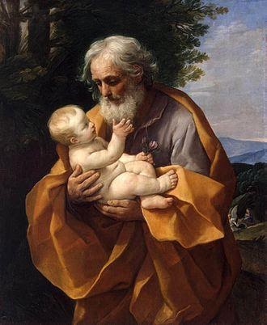
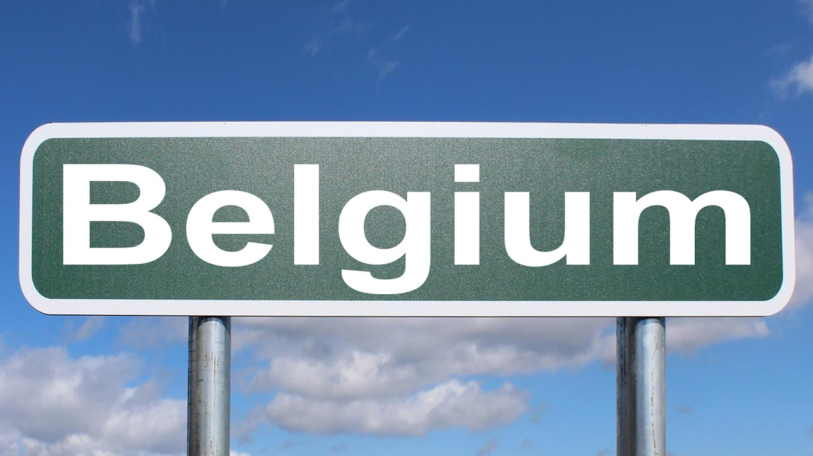
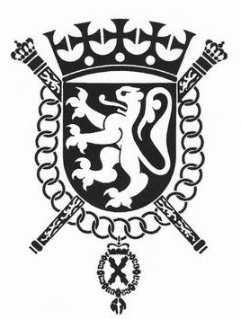

<section class="wrapper bg-light">

<article class="card shadow-lg">

[St. Joseph](https://en.wikipedia.org/wiki/Saint_Joseph)

Patron Saint of Belgium

[Genealogical Society of Flemish
Americans](https://www.flemishlibrary.org/)

[Royal Association Genealogical and Heraldic Office of
Belgium](https://en.wikipedia.org/wiki/Royal_Belgian_Genealogical_and_Heraldic_Office)

Its main purpose is the historical study of families without distinction
of social class or profession as well as the auxiliary sciences of
history, such as genealogy and heraldry. The OGHB benefits from royal
patronage and government subsidies and is thus considered as having a
somewhat greater status than a purely private society. It used to record
the arms of persons and families before this task was taken over by the
Council of Heraldry and Vexillology for the French Community and the
Flemish Heraldic Council for the Flemish Community
