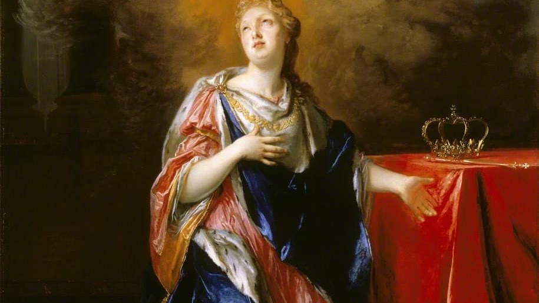
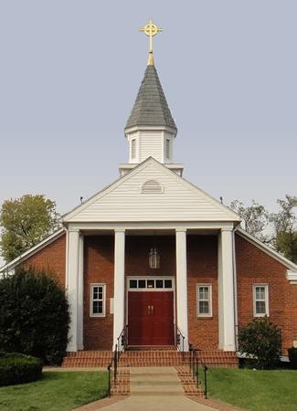

{width="7.5in"
height="1.8104166666666666in"}

[National Guild of St. Margaret of
Scotland](https://www.guildofstmargaret.com/gateway-ancestors.html)

The National Guild of St. Margaret of Scotland was founded not only to
perpetuate the memory and deeds of St. Margaret but also to act as a
genealogical and historical lineage group. The Guild operates for
educational purposes by not only educating its members but educating all
interested persons world-wide. We invite you to navigate throughout the
website to learn more about our lineage group. If you have any questions
please feel free to contact any of our Governing Officers.

{width="7.5in"
height="4.2131944444444445in"}

[Margaret of Scotland Feast
Day](https://en.wikipedia.org/wiki/Saint_Margaret_of_Scotland#Veneration)

Pope Innocent IV canonised St. Margaret in 1250 in recognition of her
personal holiness, fidelity to the Roman Catholic Church, work for
ecclesiastical reform, and charity. On 19 June 1250, after her
canonisation, her remains were transferred to a chapel in the eastern
apse of Dunfermline Abbey in Fife, Scotland.\[12\] In 1693 Pope Innocent
XII moved her feast day to 10 June in recognition of the birthdate of
the son of James VII of Scotland and II of England.\[11\] In the
revision of the General Roman Calendar in 1969, 16 November became free
and the Church transferred her feast day to 16 November, the date of her
death, on which it always had been observed in Scotland.\[13\] However,
some traditionalist Catholics continue to celebrate her feast day on 10
June.

She is also venerated as a saint in the Anglican Communion. Margaret is
honored in the Church of England and in the Episcopal Church on 16
November.

{width="3.3854166666666665in"
height="4.6875in"}

[St. Andrew and St. Margaret of
Scotland](https://www.standrewandstmargaret.org/events)

The Church of St. Andrew and St. Margaret of Scotland is a vibrant,
growing parish within the Anglican Catholic Church located just outside
our nation's capitol in the heart of Northern Virginia.  We are Anglican
because our tradition of prayer and worship is rooted in the Church of
England and the Book of Common Prayer. We are Catholic because we
believe and practice the universal or catholic faith of the church. We
are your friendly neighborhood Traditional Anglican/Episcopal Parish.

Phone: (703) 683-3343

Email: sta_stm@comcast.net

Office Hours: Mon to Wed 9:30AM - 2:30PM

Location: 402 E. Monroe Ave Alexandria, VA 22301 USA
