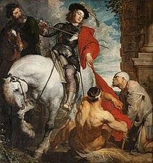

<section class="wrapper bg-light">

<article class="card shadow-lg">

[Martin of Tours](https://en.wikipedia.org/wiki/Martin_of_Tours)

On St. Martin\'s Day, children in Flanders, the southern and northern
parts of the Netherlands, and  Germany and Austria still participate in
paper lantern processions. Often, a man dressed as St. Martin rides on a
horse in front of the procession. The children sing songs about St.
Martin and about their lanterns. The food traditionally eaten on the day
is goose, a rich bird. According to legend, Martin was reluctant to
become bishop, which is why he hid in a stable filled with geese. The
noise made by the geese betrayed his location to the people who were
looking for him.

Feast day is on November 11
