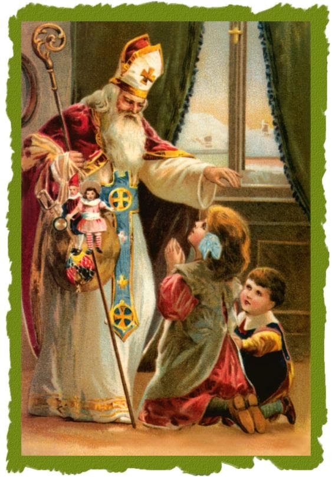

<section class="wrapper bg-light">

<article class="card shadow-lg">

St. Nicholas Day

St. Nicholas is the patron saint of children. His generous spirit and
love for youth have led the way to the popular tradition of the
gift-giving Santa Claus celebrated throughout the world. Born into a
wealthy family and orphaned young, St. Nicholas gave his inheritance to
the poor, then dedicated his life to serving God as a priest, and later
as a bishop.

The best known story of St. Nicholas is one where he secretly threw bags
of gold down a chimney in order to help a poor family's daughters be
able to marry rather than be sold into slavery. St. Nicholas was admired
by the people of his town, and his burial site is still a popular place
of pilgrimage today. St. Nicholas' feast day is celebrated on December
6. He is often depicted as a bishop in art, usually surrounded by
children.

Most people associate St. Nicholas with Christmas, Santa Claus, and
gift-giving. But why? How is this particular saint connected to the
legendary character?

St. Nicholas was born in the third century in Patara, which, at the
time, was a part of Greece (but is now present-day Turkey). He was
brought up in a wealthy and very devout Christian family. While still
young, his parents died in an epidemic, leaving Nicholas an orphan.
Nicholas gave his large inheritance away to the poor and needy. When he
was old enough, he was ordained a priest, and later became the bishop of
Myra. The people of Myra admired him for his generosity and love of
children. He was also particularly concerned for the safety of sailors,
since Myra was a port town, and many of the villagers took to the seas
to make a living.

There are many stories about St. Nicholas that show his characteristic
selflessness, as well as his devotion to the protection of children. One
such story is of an impoverished father who had no money to offer as a
dowry for his daughters to get married. In those days, a woman had to
offer a dowry to her groom in order to be considered for marriage. When
dowry money was unavailable, the woman would be considered
unmarriageable, and would often be sold into slavery. This man had three
daughters and no money for any of their dowries. Horrified at the
thought of having his daughters sold into slavery, the man prayed for
help. St. Nicholas heard of the man's plight, and, on three separate
occasions, secretly threw a bag of gold down the man's chimney. The bags
of gold landed in the stockings/shoes of the family members who had
placed them near the fireplace to warm. The man was able to offer the
dowry his daughters needed in order to marry, saving them from ending up
as slaves. Because of this story, children began placing their own
stockings and shoes near their fireplaces in hopes that St. Nicholas
would leave them a gift.

Feast Day is December 6,
