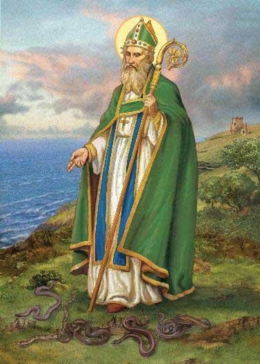

<section class="wrapper bg-light">

<article class="card shadow-lg">

[Patrick](https://catholicsaintmedals.com/saints/st-patrick/)

St Patrick was born in either Great Britain or Gaul (present day
Northern France, the sources do not agree) at a time when the Roman
Empire was losing its grip on Western Europe. The Roman Army was being
brought back to the center of the Empire, and local leaders were
beginning to control their surrounding lands. Patrick had to live near a
coast, which were often infiltrated by seaborne pirates raiding to
capture young people that they could sell as slaves.

Patrick was raised if not in luxury, living in the benefits of an
important Roman family. So when at the age of 16.he was captured by
pirates from Ireland and sold into slavery, it had to be a great shock.
He lived in captivity for six years, learning the Celtic language and
having time to pray as he guarded his cruel master's sheep throughout
the night. The time for prayer led him to make a deep commitment to
Christianity.

After six years he escaped, managed to walk 200 miles to a seaport, and
convince a local ship master to give him passage back home. But for
Patrick home was no longer in the circle of his family. He felt an
irresistible call to return to Ireland as a bishop and missionary.

Patrick returned to Ireland about 432, and for the next 30 years or so
preached especially to the pagans bringing them the message of Jesus
Christ saving all from their sins. Tradition tells the stories of many
miracles, much suffering on the part of Patrick as he was imprisoned at
least twelve times by his enemies. One time he was bound in heavy chains
marked for death. His continual suffering was so great that some of the
ancient lists of martyrs include his name. As bishop Patrick not only
preached and baptized but also organized the churches in Ireland, taught
against heresies as they showed themselves, and left members of his
missionary band behind to continue the organization.

St Patrick is one of the most popular saints in Western Christendom. He
is the Patron Saint of Ireland. He is said to have banished the snakes
from Ireland. In his iconography St Patrick is most often seen in the
miter and vestments of a bishop carrying a bishop's crozier and a
shamrock. It is said that he used the shamrock as a teaching aid when
preaching on the Trinity.

Feast day on March 17 is celebrated with singing, parades, and dancing

- [St. Patrick](https://irishparade.net/the-parade/partners-and-friends/?utm_source=copilot.com) , [Friendly Daughters of St. Patrick](https://www.friendlydaughters.org/events-1) [Emerald Isle Club](https://emeraldisleclub.com/events/)
