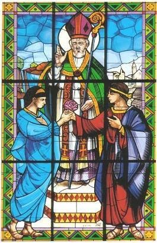

{width="2.7604166666666665in"
height="4.270833333333333in"}

[Valentine](https://catholicsaintmedals.com/saints/st-valentine/)

Heart-shaped cards, chocolates, roses, and romance. All these things
capture the essence of the popular romantic holiday Valentine's Day.
Showing love for your significant other is really what this entire
holiday is for, right? Or perhaps that is not the case. After all, the
origin of this holiday doesn't spark from romantic love at all, but more
of a platonic sacrificial love as displayed by the most honored Saint
Valentine.

In the 268 AD the Roman Empire was ruled by Emperor Claudius II, or
Claudius Gothicus. Claudius was generally tolerant of most religious
policies, but persecuted the Catholic Church. He passed an edict
forbidding the young to marry, based off of the belief that unmarried
soldiers fought better than married soldiers, who were constantly
worried for the health and well-being of their family in the soldier's
absence, or what would happen to the family in the event of the
soldier's death. Polygamy was also more popular during this time, though
much against the Christian teachings of the sanctity of marriage between
one man and one woman. Despite the restricting edict, marriage was the
special mission of St. Valentine. He secretly married young lovers in
the Catholic Church, going against Roman law to secure the bonds of love
between young couples. However, the Roman authorities eventually
captured and imprisoned him. After imprisonment and grueling torture,
St. Valentine was put before the Roman law for his acts of sealing love
in the Catholic Church against the laws of the Emperor.

Meanwhile, Asterius, one of Valentine's jailers, was the father of a
young blind girl. A Roman put up to judge Valentine, he was clearly not
a man of faith, but his concern and desperation for his daughter's
health led him to give Valentine the chance to heal his daughter during
Valentine's imprisonment. Valentine prayed to God and miraculously
healed Asterius' daughter of her blindness. Witnessing this astounding
deed of healing led to Asterius' conversion to Christianity. Shortly
thereafter in 269 AD, Valentine was condemned to a three-part execution
of beating, stoning, and beheading. Popular tradition holds that the
very last words of this man of love were written to the once-blind
daughter of the very jailer he converted, Asterius. He signed the note
he sent her "from your Valentine", and was led off to meet his painful
end.

How he signed his final note inspired the romantic messages exchanged on
Valentine's day and gives a deeper meaning to the commonplace phrase of
the holiday, "Will you be my Valentine?". The name of Valentine shows a
deeper love than many romantic relationships and a willingness to
sacrifice your life for your faith and loved ones. It shows a deep
commitment and love that should be valued and cherished in all forms in
which it is found. We celebrate his feast day, St. Valentine's Day, on
the 14th of February, and he is honored as the patron saint of lovers.
St. Valentine celebrated love in all of its forms, and inspired the
romantic holiday of love today.

Feast Day is 14 February 
