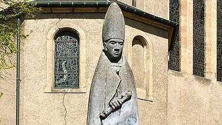

<section class="wrapper bg-light">

<article class="card shadow-lg">

[St. Willibrord](https://en.wikipedia.org/wiki/Willibrord)

Willibrord (658 -- 7 November AD 739) was an Anglo-Saxon missionary and
saint, known as the \"Apostle to the Frisians\" in the modern
Netherlands. He became the first bishop of Utrecht and died at
Echternach, Luxembourg.
