<header class="wrapper bg-light">
  
</header>

<section class="wrapper bg-light">

<article class="card shadow-lg">

We have 2 types of Membership: Full and Associate. For Full Membership,
you must show that you had a ancestor in the United States on or before
17 September 1787. We accept your membership into the following
organization for Full Membership:

\-\-\-\-\-\-\-\-\-\-\-\-\-\-\-\-\-\-\-\-\-\-\-\-\-\-\-\-\-\-\-\-\-\-\-\-\-\-\-\-\-\-\-\-\-\-\-\-\-\-\-\-\-\-\-\-\-\-\-\-\-\-\-\-\-\-\-\-\-\-\-\-\-\-\-\-\-\-\-\-\-\-\-\-\-\-\-\-\-\-\-\-\-\-\-\-\-\-\-\-\--

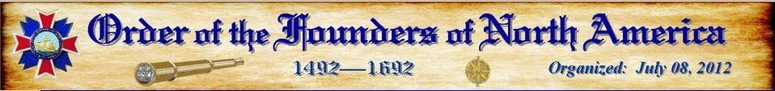

[Order of the Founders of North America](https://www.foundersofna.org/Forms/OFNA%20Ancestor%20List.pdf)

Order of the Founders of North America (OFNA) is a lineage society whose
purpose is to memorialize the individuals who founded North America
through Colonization; including the Caribbean and offshore North
Atlantic Islands during the period of 1492 to 1692.

# Virginia

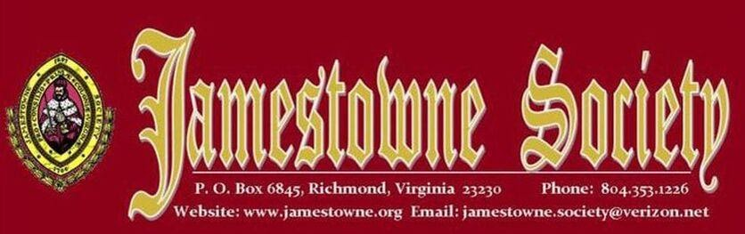

[Jamestowne Society](https://www.jamestowne.org/qualifying-ancestors.html)

**10 April 1606** stock was sold in London Company or the Virginia Company

Resident in Virginia at the time of the 1624/25 Muster or earlier

Governor, Secretary of State, Treasurer, Attorney General, Clerk of the
General Court, Member of the Council or House of Burgesses; Anglican
Church (Church of England) minister in Virginia;  served as an official
Indian Interpreter in Virginia  or owned land on Jamestown Island or
lived on the Island on or before **1699**

The following criteria are used to determine whether an early settler
may be included as a qualifying ancestor for purposes of membership in
the Jamestowne Society. The individual:

was a stockholder in the London Company or the Virginia Company; or was
a current member of one of the Guilds owning stock in the aforesaid
companies during the period of investment; or was a signer of one of the
three charters of the Virginia Company of London during the joint-stock
company period of **10 April 1606 and 24 May 1624**; 

owned land on Jamestown Island or lived on the Island **prior to
1700** 

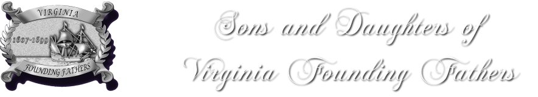

[Virginia Founding Fathers](http://www.virginiafoundingfathers.org/ancestors.html)

Any person eighteen (18) years of age or older who can prove lineal
descent from an ancestor who was a resident of the Virginia Colony on or
prior to **31 December 1699** is eligible for membership provided they
are acceptable to the Membership Committee.  Lineal descent (descendant)
shall mean blood relative in the direct line of descent.

[**First Settlers of Shenandoah Valley**](http://www.firstsettlersshenandoahvalley.com/settlers.html)

The qualifying FIRST SETTLER ancestor needed for FSSV membership is a
person who resided in an area that is located in present-day Shenandoah
Valley before 31 December 1799.

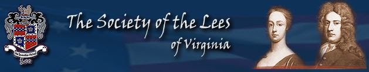

[Society of The Lees of Virginia](https://www.thesocietyoftheleesofva.org/index.php)

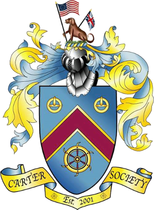

[Carter Society](https://cartersociety.org/index.php/membership)

Our forefathers, the Carters of early Virginia and their progeny, helped
forge this nation based upon freedom and liberty for all men, and it is
a heritage worthy of honor. The Carter Society has emerged slowly but
with an extreme sense of purpose. May no man sway us from the path we
have set.

[Virginia Huguenot Society](https://www.frenchhuguenots-virginiasociety.org/)

The Edict of Nantes, signed by Henry IV in April, 1598, ended the Wars
of Religion, and allowed the Huguenots some religious freedoms,
including exercise of their religion in 20 specified towns in France.
The Revocation of the Edict of Nantes by Louis XIV in October, 1685,
began a new persecution of the Huguenots. Hundreds of thousands of them
fled France for other countries. 

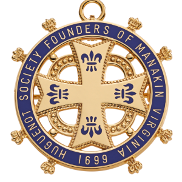

[Huguenot Society of the Founders of Manakin](https://www.huguenotmanakin.org/copy-of-old-registered-lineages)

The Huguenot Society of the Founders of Manakin in the Colony of
Virginia is a society dedicated to preserving the history and genealogy
of all French Protestant Huguenots who came to Virginia prior to 1786.  

The Society maintains a headquarters with an excellent research library
to help trace Huguenot histories. 

981 Huguenot Trail Midlothian, Virginia   23113

# Massachusetts

[General Society of Mayflower Descendants](https://themayflowersociety.org/genealogy/patriots-to-passengers/)

The General Society of Mayflower Descendants is committed to research on
the lineal descent of the Mayflower Pilgrims and education about the
Pilgrims who traveled aboard the Mayflower in **1620**. The Society provides
education and understanding of why the Mayflower Pilgrims were
important, how they shaped western civilization, and what their 1620
voyage means today and its impact on the world.  

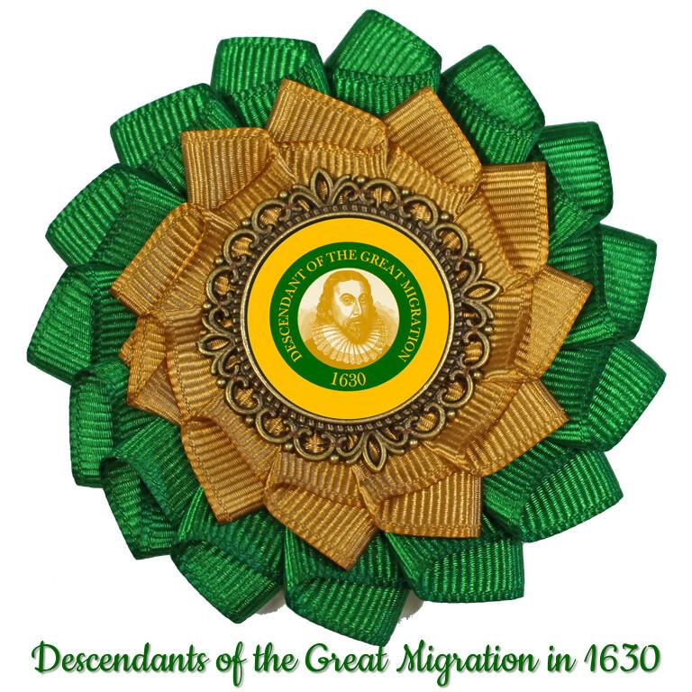

[The Winthrop Society](https://www.winthropsociety.com/doctext)

The Winthrop Society currently consists of proven descendants of the
first settlers of the Massachusetts Bay Colony. It is open to all men
and women of good character and proven descent from one or more
passengers of the Winthrop fleet, or of others who settled in the Bay
Colony and Down East\* by the end of **1640**. 

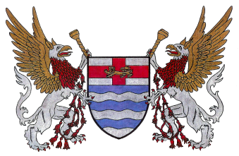

[Hereditary Order of the First Families of Massachusetts](https://newenglandsocieties.com/hoffma-eligibility/)

Men and women over the age of 18 years, who are lineal descendants of
men or women who settled within the bounds of the Massachusetts Bay
Colony **before the year 1650** may be eligible for membership.  For
purposes of this Order, the term "settler" refers to one who lived in
the Colony for at least one year, although possibly in more than one
town during that time. 

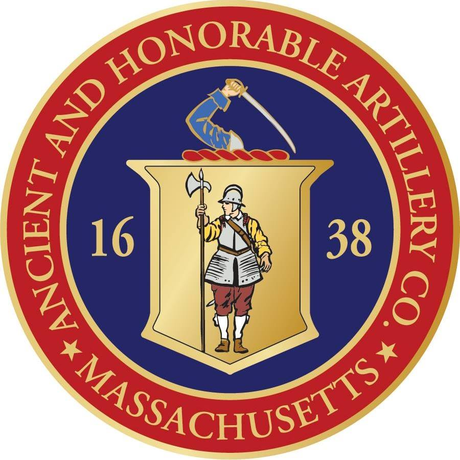

[Ancient and Honorable Artillery Company of Massachusetts](https://newenglandsocieties.com/odahac-eligibility/)

Those individuals eligible for membership shall be at least eighteen
years of age with legitimate descent from (1) a member of The Ancient
and Honorable Artillery Company of Massachusetts who served between the
years 1637-1774; (2) a minister who preached the Election Sermon during
the years 1638-1774; (3) Governor John Winthrop, (4) Deputy Governor
Thomas Dudley, (5) a member of the Council or a delegate to the General
Court in 1638 when the Company Charter was granted, (6) members of the
Ancient and Honorable Artillery Company of Massachusetts "by right of
descent," or (7) members of the National Society of Women Descendants of
The Ancient and Honorable Artillery Company. 

# Maine

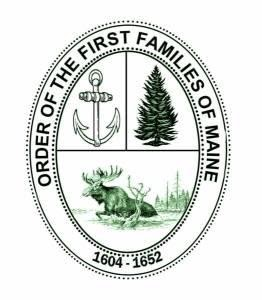

[Order of the First Families of Maine](https://newenglandsocieties.com/offme-eligibility/)

Membership is open to individuals at least eighteen years of age, who
are lineal descendants of an ancestor who was a resident of present-day
Maine, by the year** 1652**. Membership is by invitation only and shall
be extended by the President General. Membership inquiries are welcome. 

# New Hampshire

[Order of the First Families of New Hampshire](http://www.firstfamiliesofnewhampshire.org/ancestors.html)

Honor those hardy and enterprising early ancestors who concentrated
their efforts, labor and skills in building the enduring greatness of
the State of New Hampshire. Recognize and record those individuals who
established residency, owned land or businesses within the boundaries of
present day New Hampshire between 1622 - 1680. 

# New Jersey

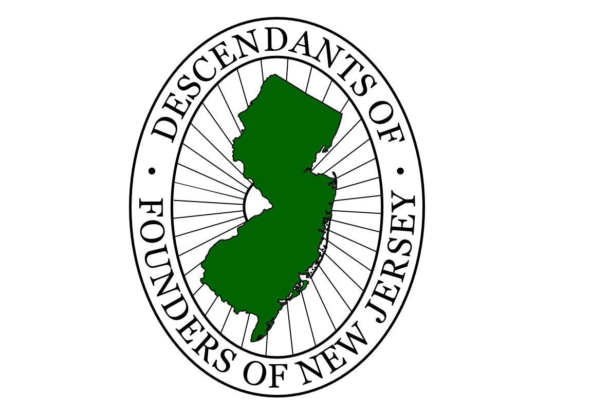

[Descendants of Founders of New Jersey](https://www.njfounders.org/founders)

Settlers came to East Jersey as early as 1618 when the Dutch from New
Amsterdam settled at Bergen (now Jersey City), and in West Jersey as
early as 1623 when Fort Nassau was established on the Delaware River. In
March 1664, King Charles II formally granted the land to his brother,
James, Duke of York. In June 1664, James divided the grant between Lord
John Berkeley and Sir George Carteret. The two Jerseys were formally
divided by the Quintipartite Deed of 1 July 1676 and governed as
separate proprietary colonies until **17 April 1702**.  

# Connecticut

[Descendants of the Founders of Ancient Windsor](https://dfaw.org/founders-list/)

The first Founders List was literally carved in stone when the Sons and
Daughters of the Pilgrims, erected the impressive Founders Monument on
the site of the first meeting house on Palisado Green on May 30, 1930,
the three-hundredth anniversary of the arrival of the Mary and John in
the waters off Nantasket. That congregation formed the nucleus of the
collection of several groups who settled in Windsor before the end of
1641. That day in 1930 marked the 300th Anniversary of the organization
of the First Church in Windsor on the dock in Plymouth just before the
Mary and John set sail. Many turned out for the church celebration that
day 

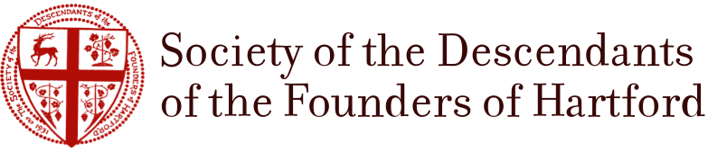

[Descendants of the Founders of Hartford](https://www.foundersofhartford.org/the-founders/)

The Society of the Descendants of the Founders of Hartford is a
charitable and educational society organized in 1931. Among its purposes
are: To foster literary, cultural, historical and other research aimed
at strengthening the public understanding of the history and traditions
of the City of Hartford; To celebrate appropriate anniversaries in the
history of the City; To erect appropriate memorials in public places to
commemorate the founding of the City; To promote the widest possible
public interest in the history of Hartford; And to make grants to other
organizations in support of the above. There are more than 300 living
members, in almost every state and in several foreign countries. We meet
once a year in Hartford for the annual Court and Dinner, which features
a guest speaker and the introduction of new members. 

# Maryland

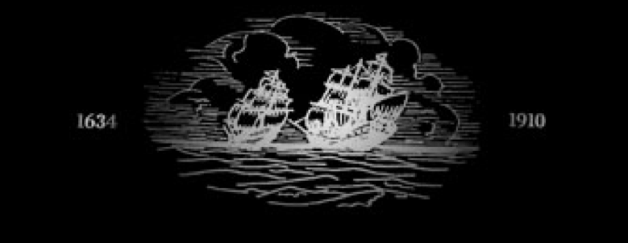

[Society of The Ark and The
Dove](https://www.thearkandthedove.com/passenger-list/)

The Society of The Ark and The Dove was founded in 1910 to perpetuate
the memory of the first families of Maryland and to provide
opportunities for fellowship for all those who trace their descent from
Lord Baltimore and from those who came on the Ark and the Dove in 1634
to settle the proprietary province of Maryland. 

# New York

[Holland Society of New York](https://hollandsociety.org/join/)

Dutch native or Dutch resident of New Netherland or the American
colonies (now a part of the United States) prior to or during the
year **1675** 

[Society of the First Families of New York]

Any individual at least eighteen years old, who is determined by the
Society to be eligible based on proven lineal descent from an ancestor
of the Founding Families of the State of New York, who was a resident of
colonial New York, or its current borders, on or before **November 24,
1783**. 

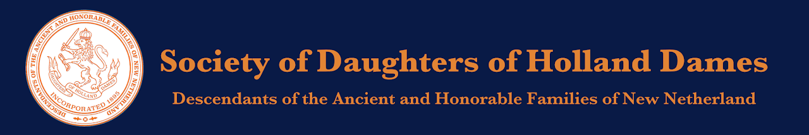

[Society of Daughters of Holland Dames](https://hollanddames.org/ancestors/)

Eligibility for Membership may be through any one of three avenues, or
all three, if desired.  Any woman shall be eligible who has reached the
age of eighteen and is lineally descended from a person, male or female,
(i) who was born, prior to the Treaty of Westminster, 1674\*, either in
the Netherlands or in New Netherland of Dutch parentage; OR (ii), whose
ancestor resided in New Netherland prior to the Treaty of Westminster,
1674 

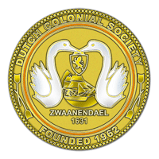

[Dutch Colonial Society](http://www.dutchcolonialsociety.org/ancestors.htm)

Proven direct descent from a Dutch settler born in the Netherlands, and
who immigrated, no later than **19 April 1775**, to any settlement in
what is now the United States. Also eligible are direct descendants of
selected non-Dutch ancestors who resided in New Netherland prior to the
Treaty of Westminster, 1674, or settled in what is now the United States
no later than 19 April 1775, AND who have proven significant service to
Dutch heritage in business, cu

# North Carolina

[Order of First Families of North Carolina](https://www.offnc.org/ancestors.html)

The Order of First Families of North Carolina is composed of, and
limited to, individuals lineally descended from a person who was a
resident/colonist on or before the 12th day of July, Anno Domini, 1729,
in that part of the PROVINCE OF CAROLINA which later became the STATE OF
NORTH CAROLINA. 

# Rhode Island

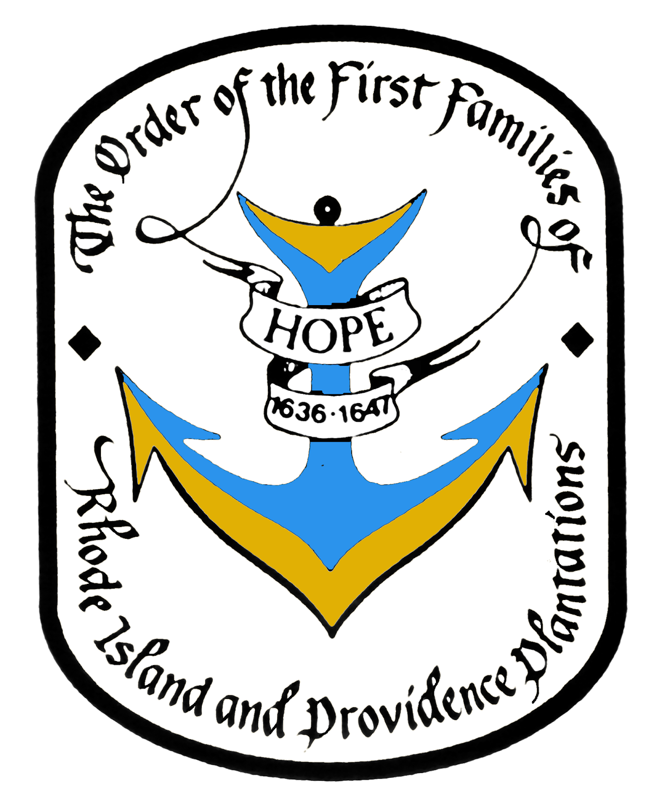

[Order of the First Families of Rhode Island and Providence Plantations](https://newenglandsocieties.com/offri-pp-eligibility/)

Men and women, age 18 and older, who can prove lineal descent from an
ancestor who was resident on land presently a part of the State of Rhode
Island and the Providence Plantations prior to January 1, 1647/8, may be
eligible for membership.  

# Pennsylvania

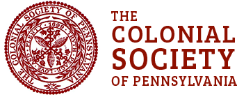

[Colonial Society of Pennsylvania](https://colonialsocietypa.org/wp-content/uploads/2021/12/CSPA-Centenial-Register-Roll-of-Ancestors.pdf)

The Colonial Society of Pennsylvania celebrates anniversaries of events
connected to the settlement of Pennsylvania which occurred prior to
1700, as well as the collection, preservation, and publishing of records
and documents related to the early history of our Commonwealth.

[Welcome Society](https://www.welcomesociety.org/ancestors.html)

The purposes of the society are given in its 1906 charter (Listed
Above).  Though it is not specifically stated in the charter, the
Society was founded as nonprofit and educational. Originally, the
membership was limited to the descendants (male or female) of those who
were passengers on the Welcome.  Presently, membership is composed of
descendants of those ancestors who traveled with fellow Quakers to
America during the course of the year of 1682.  This includes 22 ships
and 23 crossings of the Atlantic. 

 

[Huguenot Society of Pennsylvania](https://pahuguenotsociety.wixsite.com/website)

In 1918 in Reading, Pennsylvania, approximately ten men and women of
known Huguenot descent founded The Huguenot Society of Pennsylvania, one
of the first societies for the descendants of Huguenots established in
the United States. They settled on April 13, 1918 (the 320th anniversary
of the Edict of Nantes) for their first official meeting, and set out to
write a charter, find interested members, and decide upon the
organization\'s structure. At this meeting, they developed a set of
objectives for the organization, which included perpetuating and
maintaining the history, principles, and beliefs of the Huguenots;
\"publicly commemorating at stated times the principal events in the
history of the Huguenot;\" maintaining a library and museum of materials
pertaining to Huguenots in America and specifically in Pennsylvania;
promoting scholarly study of their history; and above all, celebrating
and preserving the spirit of a people who withstood persecution and
intolerance \"because of their adherence to the basic tenets of the
Protestant faith and their devotion to liberty.\" This is a list of the
original Huguenot Society of Pennsylvania members in 1918.  To read the
original proceedings of the 1918 meeting,
click [here](https://cdn.website-editor.net/020d9c979f77483189db333592c7de7f/files/uploaded/huguenotsocietyo00norr.pdf).

# South Carolina

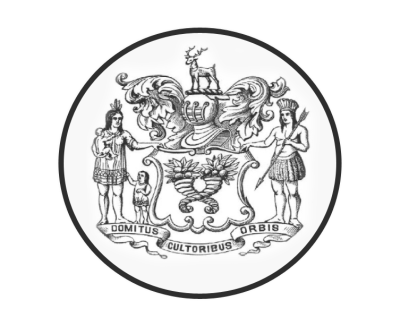

[The Society of First Families of South Carolina](https://firstfamiliesofsc.com/ancestors)

South Carolinians ​​​are proud of our long, rich history. Our state has
been influencing the birth and direction of a nation since  the earliest
days of colonization.  The Society of First Families of South
Carolina **1670-1700**  is working to perpetuate the memory of those who
achieved a permanent settlement in South Carolina between 1670 and 1700;
cherish, maintain and extend the institution of American freedom; and
foster true patriotism and love of country.

# Colonial Period

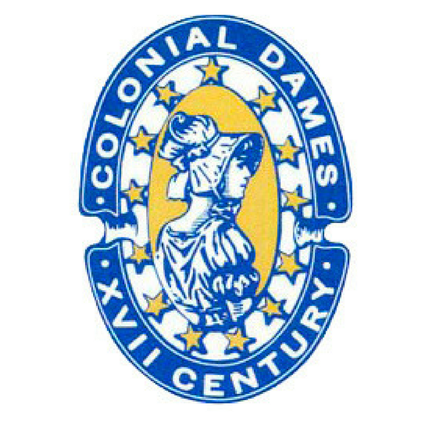

[National Society Colonial Dames 17th Century](https://www.facebook.com/NSCDXVIIC?__tn__=-UC*F)

Any woman eighteen years of age or over of good moral character is
eligible for membership, provided she has been invited by the Society,
is eligible through birth parents or adopted parents if there is a blood
relationship to the applicant, and is the lineal descendant of an
ancestor who lived and served prior to **1701** in one of the Original
Colonies in the geographical area of the present United States of
America. Lineal descendant shall mean direct legal blood descendant.

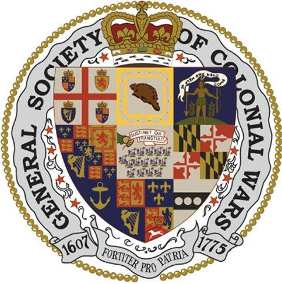

[Society of Colonial Wars](https://www.gscw.org/)

Ancestor who served as a military or naval officer, or as a soldier,
sailor, or

marine, or as a privateersman, under authority of any of the Colonies
which

afterward formed the United States, or in the forces of Great Britain 

which participated with those of the said Colonies in any wars in which 

the said Colonies were engaged, or in which they enrolled men, during
the 

period from the settlement of Jamestown, **May 13, 1607**, to the
Battle 

of Lexington, **April 19, 1775**

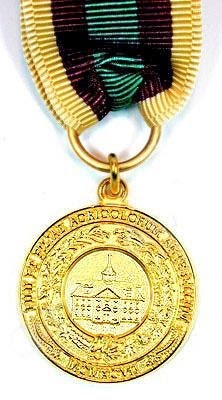

[National Society Sons and Daughters of Antebellum Planters ](https://antebellumplanters.org/ancestors/)

To identify and honor the memory of ancestors who were "planters" within
lands today comprising the 48 states of the continental United States
between 1607 and 12 April, 1861. A "planter" is a large farmer, one
owning not less than 500 acres of land. A rancher would be included in
this definition. The 500 acres or more, does not have to be in one plot
or in contiguous plots or even in the same county or same state. The
property of one spouse may be aggregated with the property of the other
spouse even if legal title is vested in a trustee, but aggregation is
permitted only where the applicant descends from both spouses. Also
eligible are collateral descendants of a "planter" brother or sister of
the whole blood of a lineal ancestor,

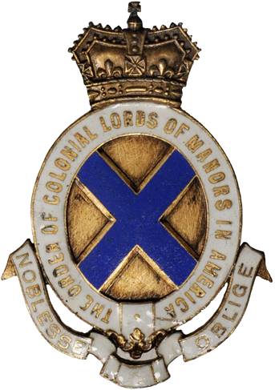

[Order of Colonial Lords of Manors in
America](https://www.coloniallords.org/manors/)

Membership in the Order is solely by invitation, and is open to men and
women who are lineally descended in either the male or female line from
a recognized Patroon, Seigneur, or Lord of a Manor of New Netherland,
the Province of New York, the Province of Maryland, or a similar system
of landholding (with Court Leet or Court Baron) in any other of the
original colonies.

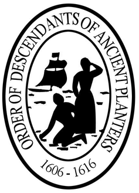

[Order of Descendants of Ancient
Planters](http://www.ancient-planters.org/ancestors.html)

The term \"Ancient Planter\" is applied to those persons who arrived in
Virginia prior to **June 1616**, remained for a period of three years,
and paid their passage. They received the first patents of land in the
new world from the Virginia Company of London, as authorized by Governor
Sir Thomas Dale in 1618, for their personal adventure. 

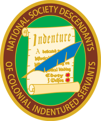

[National Society Descendants of Colonial Indentured
Servants](http://www.indenturedservants.org/ancestors.html)

To preserve the history of indentured servitude through (1) conservation
of historical documents, (2) publication and/or abstracting of primary
source materials, (3) partnering with organizations to further public
awareness acknowledge the contributions of our immigrant indentured
servant ancestors, who brought their talents, skills, and labor to the
colonies to help make their new found country a success. 

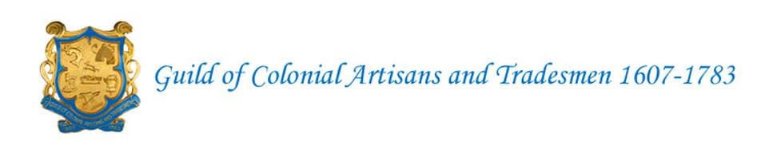

[Guild of Colonial Artisans and
Tradesmen](https://guildcolonialartsandtrades.weebly.com/ancestors.html)

The Guild of Colonial Artisans and Tradesmen 1607-1783 is a hereditary
society established to honor the memory and skills of our Colonial
Ancestors who were accomplished in the field of art or trades which
strengthened the building of our Nation.

[Descendants of Colonial
Clergy](https://www.colonialclergy.com/membership/)

For additional research and information on colonial ministers, the
following [books](https://www.colonialclergy.com/?page_id=20) should be
consulted. The
following [books](https://www.colonialclergy.com/?page_id=16) should be
consulted for lists of ministers of the colonial period who are the
qualifying clergy.

[National Society of The Colonial Dames of America](https://nscda.org/historical-activities/ancestor-biographies/)

The Corporate Societies shall be composed entirely of women who are
lineal bloodline descendants from an ancestor of worthy life who,
residing in an American colony, rendered efficient service to our
country during the Colonial period, either in the founding of a State or
Commonwealth, or of an institution which has survived and developed into
importance, or who shall have held an important position in a Colonial
government, or who by distinguished services, shall have contributed to
the founding of our nation. DATE OF ANCESTOR'S SERVICES. All services
which constitute a claim to membership must have been rendered
before** July 5, 1776** 

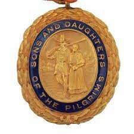

[National Society Sons and Daughters of the
Pilgrims](https://www.societyofthepilgrims.com/qualifying-ancestors.html)

We appreciate your interest in the National Society Sons and Daughters
of the Pilgrims. A male or female, without regard to religion or place
of origin, is eligible to join our Society if he or she is a direct
descendant of a "Pilgrim."  The term "Pilgrim" denotes any immigrant who
settled before **1700** within the territory which later became the
forty-eight contiguous states of the United States of America. 

[Order of the Founders & Patiots of
America](https://ofpa.org/genealogy/)

Membership in the Order of the Founders and Patriots of America is
challenging by design. With its double generational requirement and the
need for a Founder on or  before May 12, 1657 , the Order is considered
one of the most exclusive lineage societies one can aspire to join.

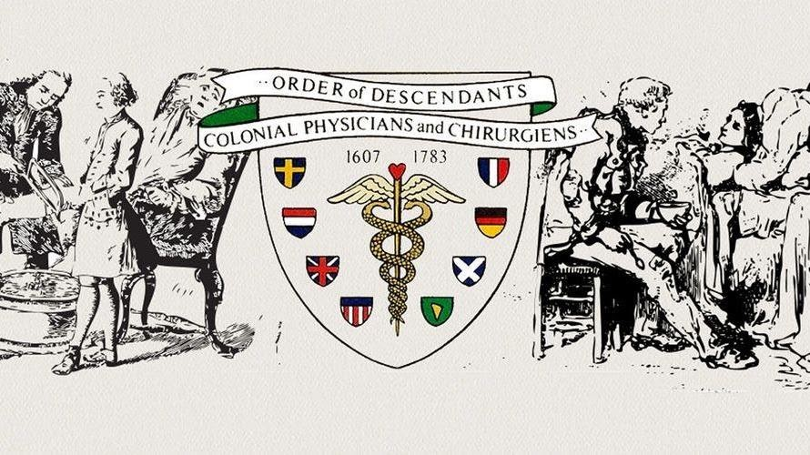

[Order of Descendants of Colonial Physicians and
Chirurgiens](https://ordercolonialpandc.org/ancestor-list)

Anyone who can prove blood lineal descendant from a Physician,
Chirurgien, Apothecary, or Licensed Midwife who practiced their
professions on the North American continent from 1607 to 1783 shall be
eligible for membership in this Order.

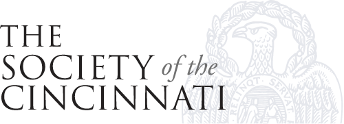

[Society of the
Cincinnati](https://www.americanrevolutioninstitute.org/soldiers-and-sailors-of-the-revolutionary-war/officers-represented-in-the-society-of-the-cincinnati/)

The Society of the Cincinnati is a fraternal, hereditary society founded
in 1783 to commemorate the American Revolutionary War that saw the
creation of the United States. Membership is largely restricted to
descendants of military officers who served in the Continental Army. The
Society has thirteen constituent societies in the United States and one
in France. It was founded to perpetuate \"the remembrance of this vast
event\" (the achievement of American Independence), \"to preserve
inviolate those exalted rights and liberties of human nature,\" and \"to
render permanent the cordial affection subsisting among the officers\"
of the Continental Army who served in the Revolutionary War.

 

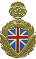

[National Society Daughters of Colonial
Wars](https://www.nsdcw.org/ancestor-s-list)

To honor and perpetuate the memory and spirit of the men and women who,
by their acts and counsel, assisted in the establishment, defense and
preservation of the American Colonies.  To collect and preserve records
relative to the American Colonial Period, and records of service of men
who assisted in the establishment, defense and preservation of the
American Colonies. To promote historical research and the study of
history and to commemorate the events of the American Colony Period
between 1607 and 1775. 

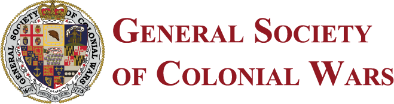

[General Society of Colonial Wars](https://www.gscw.org/)

Who served as a military or naval officer, or as a soldier, sailor, or
marine, or as a privateersman, under authority of any of the Colonies
which afterward formed the United States, or in the forces of Great
Britain  which participated with those of the said Colonies in any wars
in which  the said Colonies were engaged, or in which they enrolled men,
during the period from the settlement of Jamestown, May 13, 1607, to the
Battle of Lexington, April 19, 1775 

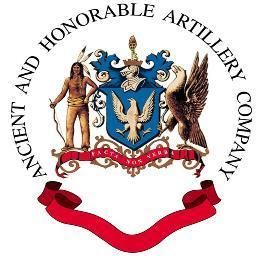

[Ancient and Honorable Artillery
Company](https://wdahac.wixsite.com/wdahac/eligible-ancestors)

Women Descendants of the Ancient & Honorable Artillery is made up of
lineal descendants of the 24 Founders of 1637 and for all members of the
Ancient and Honorable Artillery Company between 1638-1774. for lineal
descendants of the General court of Massachusetts Bay when the Charter
was granted in 1638, namely, the Governor, the Governor\'s Council and
for the Deputies to the General Court of 1638.

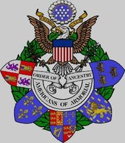

[Order of Americans of Armorial
Ancestry](http://www.armorial.us/arms.htm)

Any person aged eighteen or over, of good moral character and reputation
is eligible for membership in the Order provided the candidates prove
descent from an immigrant ancestor who settled on or before 04 July 1776
within a territory that became the forty-eight contiguous states of the
United States of America and who had a proven right to bear arms in the
settler's country of origin. 

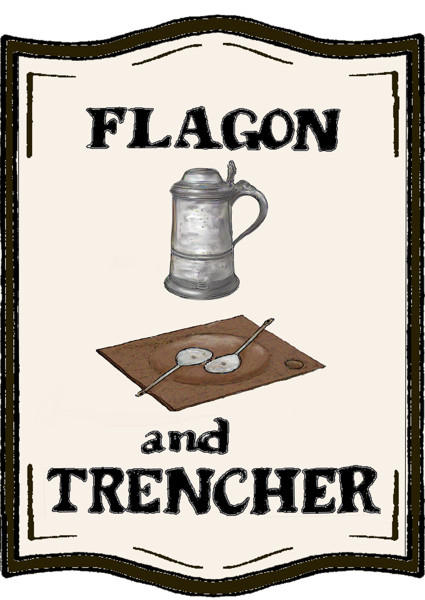

[Flagon and Trencher](http://www.flagonandtrencher.org/Ancestors.htm)

Flagon and Trencher is a hereditary society composed of men and women
who can trace ancestry to one or more licensed operators of an ordinary
tavern, inn, public house, or hostel, prior to July 4, 1776, in the area
that became the original thirteen U.S. states. The society has published
a number of biographical anthologies, documenting the lives of select
colonial taverners. A record extraction project is underway. The
objective is to eventually identify every colonial taverner for whom
evidence survives.

[National Society Colonial Dames 17th
Century](https://www.facebook.com/NSCDXVIIC?__tn__=-UC*F)

The National Society Colonial Dames XVII Century is an organization of
women, eighteen years of age or over, who are lineal descendants of an
ancestor who lived and served prior to 1701 in one of the Original
Colonies in the geographical area of the present United State of
America.  Our members are devoted to preserving the memory of those that
settled in the United States of America prior to 1701.

The National Society Colonial Dames XVII Century, as a non-profit
organization, was established on July 15, 1915, with its headquarters in
Washington D.C.  Constructed in 1884, the headquarters building holds
historical significance and is listed on the National Register of
Historic Places.

1300 New Hampshire Avenue, NW · Washington, DC 20036-1502 · Phone:
202-293-1700 

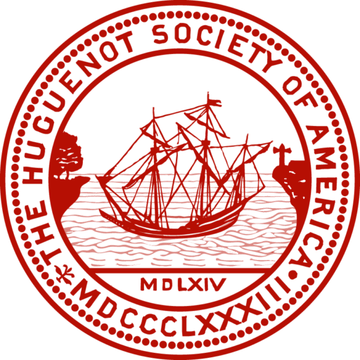

[Huguenot Society of
America](https://www.huguenotsocietyofamerica.org/history/ancestors/)

Applicants must be above the age of eighteen and a lineal descendant in
the male or female line of a Huguenot who emigrated from France, and
that such Huguenot émigré or one of his or her descendants in the same
line either settled in what is now the United States of America or left
France for countries other than America prior to the promulgation of the
Edict of Toleration on November 28, 1787. 

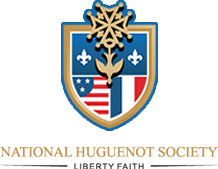

[National Huguenot
Society](https://nationalhuguenotsociety.org/ancestor-lookup/)

The objectives of The National Huguenot Society are patriotic,
religious, historical, and educational. Their design is to perpetuate
the memory, the spirit, and the deeds of the men and women in France
known as Huguenots who were persecuted in the 16th and 17th centuries
because of their adherence to the basic tenets of the Protestant faith
and their devotion to liberty, and who emigrated either directly or
through other countries to North America and contributed by their
character and ability to the development of the United States. 

# American Revolution

[Descendants of Colonial Regulators](https://colonialregulators.weebly.com/)

Descendants of Colonial Regulators was initially formed to honor those
ancestors who took part in the Regulation movements that occurred in
North Carolina and South Carolina prior to the Revolutionary War. The
War of Regulation or the Regulator Movement was an uprising that
occurred from about 1765 and ended around 1771. During that time
citizens took up arms against colonial officials they viewed as corrupt.
Though the rebellion did not change the power structure, some historians
view it as a catalyst to the American Revolution.

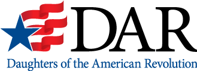

[Daughters of the American Revolution ](https://www.dar.org/national-society/accepted-revolutionary-war-service)

In applying for DAR membership, women must document their lineage back
to an ancestor who aided the cause of American independence. These
efforts may come through military, civil or patriotic service and must
occur during the period between **19 April 1775** (Battle of Lexington)
and **26 November 1783** (withdrawal of British Troops from New York).

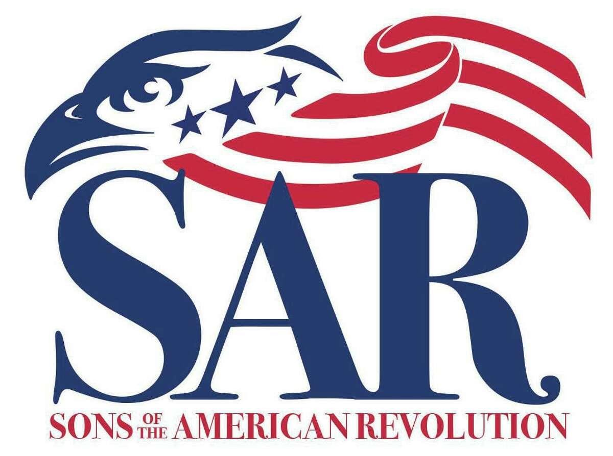

[Sons of American Revolution](https://sarpatriots.sar.org/patriot/search/)

The Sons of the American Revolution honors our Revolutionary War patriot
ancestors by promoting patriotism, serving our communities and educating
and inspiring future generations about the founding principles of our
Country. The SAR accepts patriotic service rendered, with some
exceptions, for the period **between 19 April 1775 and 26 November
1783**. 

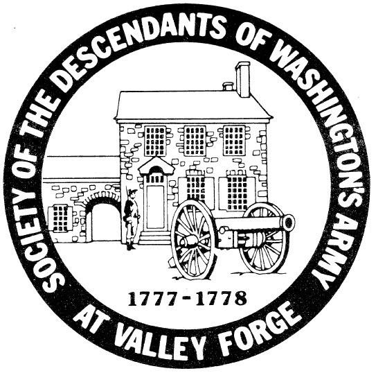

[Society of the Descendants of Washington\'s Army at Valley
Forge](https://www.valleyforgesociety.com/_files/ugd/cbe2c2_72d505a5537b47a981e600f0195a743e.pdf)

The Society of the Descendants of Washington\'s Army at Valley Forge is
a historical & genealogical organization where one must prove descent
from a person that spent time at Valley Forge, Pennsylvania with the
Continental Army between December 19, 1777 and June 19, 1778. 

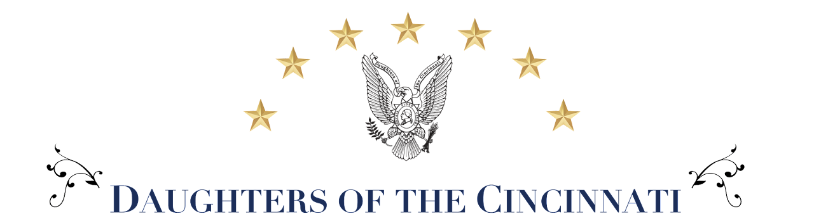

[Daughters of the Cincinnati](https://daughters1894.org/membership/)

Membership in the Daughters of the Cincinnati is by invitation only to
any woman over the age of eighteen having an ancestor who served as an
officer in the Continental Army, Continental Navy, Continental Marines,
the French Royal Army, and the French Royal Navy during the American
Revolutionary War (**1775 -- 1783**). 

\_\_\_\_\_\_\_\_\_\_\_\_\_\_\_\_\_\_\_\_\_\_\_\_\_\_\_\_\_\_\_\_\_\_\_\_\_\_\_\_\_\_\_\_\_\_\_\_\_\_\_\_\_\_\_\_\_\_\_\_\_\_\_\_\_\_\_\_\_\_\_\_\_\_

NOTE: From the following organization your ancestor must be proven to be
here on or before 17 September 1787.

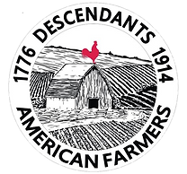

[National Society Descendants of American
Farmers](https://www.nsdoaf.com/our-ancestors)

Founded in 2019, the National Society Descendants of American Farmers is
a non-profit, non-political organization for descendants of American
farmers who  were living within the present boundaries of the contiguous
continental states of the United States of America between July 4,
1776 - July 4, 1914 .  Whether you are currently a member of the NSDOAF,
a prospective member, or you are trying to learn more about the Society,
this website will hopefully give you the information you are seeking. 
Please click on the links that are most relevant to you.

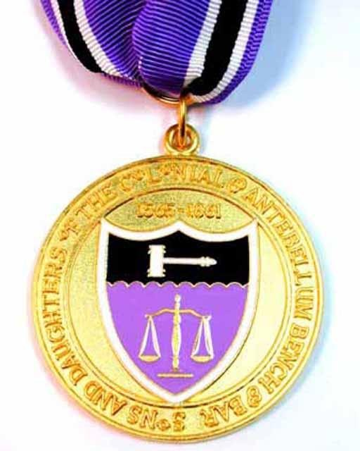

[Colonial and Antebellum Bench and Bar](https://benchbar.us/ancestors/)

Membership in this society is open to anyone age 18 or older who can
prove lineal descent from an ancestor who served as a judge or a lawyer
prior to 12 April 1861 in any part of what is now the Continental United
States of America. 

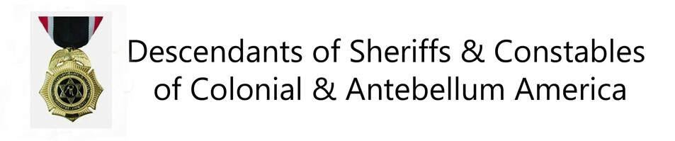

[Descendants of Sheriffs &
Constables](https://sheriffsandconstables.weebly.com/ancestors.html)

Membership is extended to men and women 18 years of age or older who are
lineal descendants of an ancestor from any area which later became part
of the United States of America who held a position of any public-sector
(non-military) law enforcement officer (also called peace officer) prior
to 1861 charged with upholding the peace and empowered to arrest
criminals. The following is a partial list of acceptable positions:
Sheriff, High Sheriff, Under Sheriff, Deputy Sheriff, Constable, High
Constable, Lesser Constable, Marshal, Corps of Rangers (in TX), Bailiff,
Night Watch, Deputy, Jailer, Gaoler, Conservator of the Peace (not a
Judge or Justice), Prison Guard, Detective (not Private), Police Officer
(Boston, New York, Philadelphia, et al.), Correctional Officer, Customs
Officer, Immigration Officer, Probation Officer, Parole Officer,
Auxiliary Officer, Court Messenger (New Amsterdam), and all the deputies
of the above.

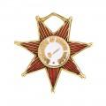

[Continental Society Daughters of Indian
Wars](https://csdiw.org/qualifying-ancestors/)

CSDIW was organized in Atlanta, Georgia in 1988.  Our organization is
comprised of women who are citizens of either the United States of
America, The Dominion of Canada, or Mexico,  who are not less than
sixteen years of age and is the lineal descendant of a Native American
or Immigrant American ancestor who participated in any capacity, such as
Passive Service, or in actual hostilities, one against the other, during
the period May 14, 1607 to 1900. 

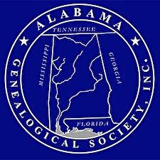

[Alabama Genealogical
Society](https://algensoc.org/main/ancestorindex.pdf)

First Families of Alabama is a certificate program offered by the
Alabama Genealogical Society to its members and is designed to identify
and honor the memory of early residents of the state of Alabama. Early
residents are those settlers who resided within the present boundaries
of Alabama prior to statehood, 14 December 1819. Criteria for the
certificate are:

- Membership\* in Alabama Genealogical Society

- Completion of Application and Proof of Descent

- Attached copies of documented proof of descent for each generation

- A check for \$20.00 for each certificate payable to Alabama
  Genealogical Society

The application and documentation is submitted to the First Families of
Alabama Committee for verification of the information. Approved
applications and documentation will be deposited in the [Special
Collection
Department](http://library.samford.edu/about/sc/aboutsc.html), Samford
University Library, to help preserve the history of your ancestors and
aid others in their research. This safe location prevents the possible
loss of your valuable family research and preserves your lineage for
easy retrieval by researchers. This program is one sure way to preserve
your lineage as each member qualifying for the First Families of Alabama
will receive a beautiful signed and numbered certificate, suitable for
framing.

\*Membership information can be found in the [membership
section](https://algensoc.org/main/benefits.html) 

[Order of the First Families of
Mississippi](https://offms.org/history-of-the-order/ancestor-roster/)

OFFM is committed to genealogical documentation, historical education,
and recognition of the achievements of our state, not only from the
colonial period of 1699 through 1817 

[New England Society In The City Of New
York](https://nesnyc.org/founders-day/)

The New England Society in the City of New York (NES) is one of the
oldest social and charitable organizations in the United States, and was
founded in 1805 to promote \"friendship, charity and mutual assistance\"
among and on behalf of New Englanders living in New York.

NES celebrates the New England spirit and heritage through its
philanthropic outreach, social events and cultural activities. Our
charitable focus is education. The NES Scholarship Program assists New
York City students at New England colleges and universities. Another
signature program is the annual New England Society Book Awards, which
recognize books of merit that honor New England and its culture.

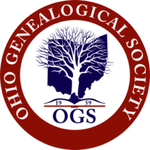

[Military Order of the Daughters and Sons of
Ohio](https://www.ogs.org/search-databases/)

Any member of OGS who can prove satisfactory lineal descent from a
resident of the State of Ohio who served in the armed forces of the
United States or the British colonial forces of the original thirteen
colonies prior to the American Revolutionary War, according to the
Society's rules and guidelines, is eligible to become a member of the
Military Order of the Daughters and Sons of Ohio (MODSO).

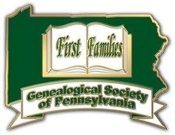

[Genealogical Society of
Pennsylvania](https://genpa.org/first-families-of-pennsylvania/)

Colony and Commonwealth: **1638--1790** 

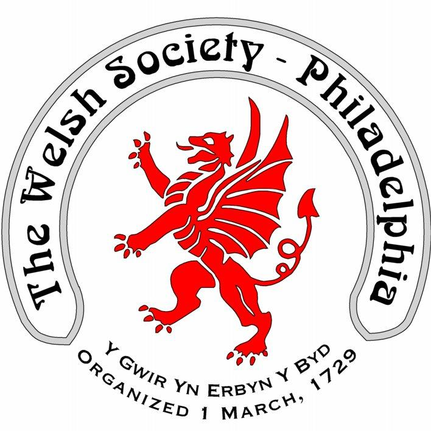

[The Welsh Society of
Philadelphia](https://www.facebook.com/PhiladelphiaWelsh?__tn__=-UC*F)

The Welsh Society of Philadelphia has members that have a wide range of
ages and interests. Everyone who shares our interest in keeping current
with local Welsh American events is most welcome. Membership of the
Welsh Society of Philadelphia provides the following opportunities:

A chance to participate in the historic and vibrant Welsh American
community

Enjoy a variety of social and heritage events

Singing and community spirit at the Gymanfa Ganu

Receive notifications of upcoming events

Recognize outstanding Welsh Americans through the Robert Morris Award 

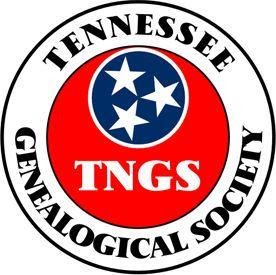

[Tennessee Genealogical Society](https://tngs.org/Certificates/)

Colonial \-- prior to 1 June 1796 

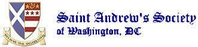

[Kirkin' O' The Tartan](https://saintandrewsociety.org/events/kirkin/)

T he St. Andrew's Society has conducted the Kirkin' Service at the
National Cathedral.  Reserved seating in the National Cathedral is
available for this service in reserved areas. Reservations are free to
all Members and Guests and they may be obtained from the Society's
Sergeant-at-Arms and Kirkin' Chairman David S. McKenzie. For seating ,
please e-mail the Chairman at [caberman162@yahoo.com]{.underline} 

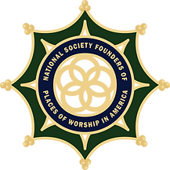

[National Society Founders of Places of Worship in
America ](https://www.nsfpwa.org/ancestors)

Membership is open to males and females of good moral character and
reputation, at least eighteen years of age, who can prove lineal descent
from a person who, in the timeframe prior to and including 1850 and
within the territory that became the forty-eight contiguous states of
the United States of America, contributed in one of the following
categories:

A founding signer of a Covenant, doctrine, named in town minutes or
referenced in historical documents as having met in faith or began a new
house of worship in any faith.

Held membership within first year of founding or meeting.

Donated land or monies which were used to build a meeting place/building
for worship.

Permitted property (land, home or building) to be used for the purposes
of holding worship.

Circuit Rider and mobile Ministries, in which clergy traveled to more
than one location to hold service.

[Early Quaker
Descendants](http://www.earlyquakers.org/qualifyingancestors.html)

Men, Women and children who establish descent, either lineal or
collateral, from an early member of the Society of Friends (1835 or
before), throughout the world, shall be eligible for membership. Junior
members are eligible from birth to age 25 years. 

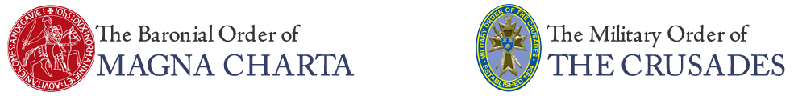

[Magna Carta Barons](https://www.magnacharta.com/gateway-ancestors/)

Magna Charta Barons, Crusaders and Templar Knights appears below. Note
that many of these Gateway ancestors have approved lines that will lead
to 1) Magna Carta Barons, 2) Crusaders and 3) Templar Knights. But not
all Gateways listed have approved lines that will qualify for membership
in all three Orders.  New information is always welcome and the Order
will be glad to add to this list if genealogical research proves it
advisable. As always, the Order retains the right to accept or reject a
line based on the most current genealogical research. 

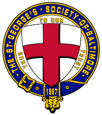

[St. George\'s Society of
Baltimore](https://www.stgeorgesbalt.org/events)

The St. George\'s Society of Baltimore is a philanthropic and social
organization founded in 1867 to afford relief and advice to the indigent
natives of England and Wales and the British Colonies or to their wives,
widows and children; and to promote social intercourse amongst its
members. In recent years, through its 501(c)(3) Foundation, The St.
George\'s Society of Baltimore has supported the Invictus Games
Foundation, Help For Heroes, the Royal British Legion, and Prince\'s
Trust USA, as well as providing hospitality to officers and ship\'s
company of visiting Royal Navy ships. The Society also sponsors several
events celebrating British culture and history annually to promote
fellowship amongst its members and hospitality for their families,
friends and guests.

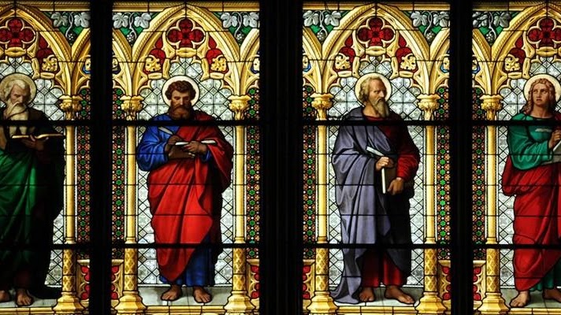

[National Society of
Saints](http://nationalsocietyofsaintsandsinners.org/wp-content/uploads/2018/07/Approved-List-of-Saints-07-15-15.pdf)

Welcome to the National Society of Saints and Sinners website.  We are
adding new information daily.  Please check back with us often, as we
enlarge our list of approved Saints.  Our first Council meeting on 14
April 2011, was a tremendous success. Several items of import to our
members were discussed and resolved. We extend a heartfelt thank you to
our members for helping us make the Society an even greater pleasure to
join.

[Order of the Crown of
Charlemagne](https://www.charlemagne.org/Gateway.html)

The Order of the Crown of Charlemagne was organized in the United States
on January 1, 1939 and incorporated in the District of Columbia on
October 10, 1939. It is an idependent patriotic and lineal society named
in honor of the Emperor Charles the Great (742-814) and also named after
an ancient noble and chivalric order in Europe which according to
tradition was instituted by the Emperor in 802 to distinquish and honor
his most valiant warriors who fought in the war against the heathen
Saxons. Descendants of the Emperor have Maintained the order without
great interruption through the centuries. The Order meets once a year in
Washington, DC at a \"black tie\" dinner event the second Thursday of
April. 

[Magna Carta Barons](https://www.magnacharta.com/gateway-ancestors/)

Magna Charta Barons, Crusaders and Templar Knights appears below. Note
that many of these Gateway ancestors have approved lines that will lead
to 1) Magna Carta Barons, 2) Crusaders and 3) Templar Knights. But not
all Gateways listed have approved lines that will qualify for membership
in all three Orders.  New information is always welcome and the Order
will be glad to add to this list if genealogical research proves it
advisable. As always, the Order retains the right to accept or reject a
line based on the most current genealogical research. 

[St. Andrew\'s Society ](https://saintandrewsociety.org/events/)

Founded over 250 years ago, we are a fraternity of Scottish descendants
from around the Nation's Capital who celebrate our Scottish culture and
heritage.  Our mission to "Relieve the Distressed" is fulfilled through
charitable works through the Washington Scots Charity & Education Fund.

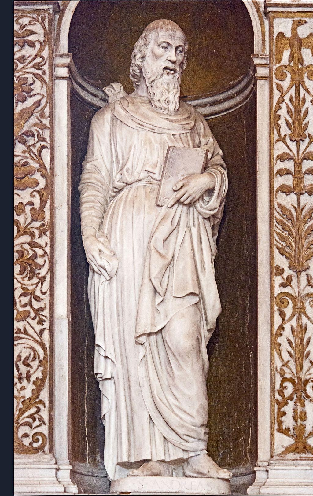

[St Andrew\'s
Socitieties](http://www.scotland.org/events/st-andrews-day/st-andrews-societies)

Wherever they've settled, Scots have taken with them the traits that
their homeland is so well known for. Find out how the charitable
institutions they set up all those years ago are helping spread
Scotland's values across the globe

**Prairie Patriot Certificates** are available for descendants of all
wars. The Veteran must have served during the indicated war and lived,
died, or was buried in Illinois. The applicant may be a direct
descendant (through bloodline \-- \"child of a child\") or an indirect
descendant (through a sibling of the veteran) and must prove the
relationship on the accompanying forms. Wars that are included in the
project are: **Revolutionary War**

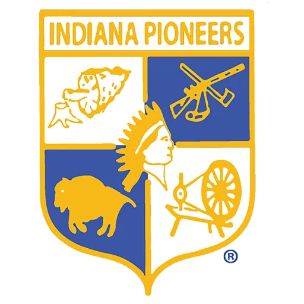

**If you have a ***direct-line ancestor*** that resided in the State of
Indiana by December of the ***eligibility year***, then you may submit
an application for membership in The Society of Indiana Pioneers.**

The Society has a two-tiered eligibility map, shown below. Ancestors
must have resided there not later than **December 31, 1840**.

The Michigan Pre-Statehood and First Families certificates are offered
by Michigan Genealogical Council as a way to honor our ancestors who
settled the Great Lakes State. Recipients will receive either the
Pre-Statehood or the First Families certificate, depending on the
arrival date of their earliest Michigan (or Michigan territory)
ancestor. Pre-Statehood before Jan. 26, 1837

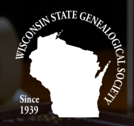

A Wisconsin Pioneer or Century Ancestors Certificate is awarded to
applicants who submit evidence to prove direct descent, and that their
ancestor settled in Wisconsin prior to 1851

</article>

</section>
