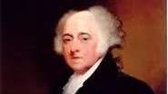
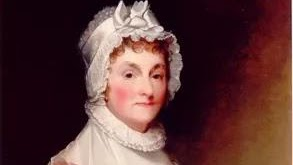

The Adams were
Unitarian [Congregationalists](https://www.firstfamilies.us/faith/congregationalists). 
They lived
in [Quincy](https://www.firstfamilies.us/events/massachusetts/quincy) MA. 

{width="2.5in"
height="1.5833333333333333in"}

[Junior
Ranger](https://www.nps.gov/adam/learn/kidsyouth/beajuniorranger.htm)

[Junior Ranger Booklet for Ages 6 to
8](https://www.nps.gov/adam/learn/kidsyouth/upload/Adams-Junior-Ranger-Booklet-Ages-6-to-8.pdf)

[Junior Ranger Booklet for Ages 9 and
Up](https://www.nps.gov/adam/learn/kidsyouth/upload/Adams-Junior-Ranger-Booklet-ages-9.pdf)

{width="1.9270833333333333in"
height="1.0833333333333333in"}

[John Adams (1735 -
1826)](https://www.nps.gov/adam/learn/historyculture/john-adams-1735-1826.htm)

John Adams, son of Deacon John Adams and Susanna Boylston, was a fifth
generation descendant from Henry Adams, who reached the shores of
America from England in 1633. Henry with his wife and eight children was
given a grant of forty acres of land not far from where John and Susanna
Boylston Adams brought up their three sons, including their eldest,
John.

{width="3.0520833333333335in"
height="1.71875in"}

[Abigail Adams (1744 -
1818)](https://www.nps.gov/adam/learn/historyculture/abigail-adams-1744-1818.htm)

Abigail Adams brought more intellect and ability to the position of
first lady of the United States than any other woman. President Harry
Truman once noted that Abigail \"would have been a better President than
her husband.\" Yet she lived in an era when women were not supposed to
have, or express, their opinions about government or the exciting events
of the times. Abigail Adams struggled her whole life with the
limitations that society placed upon her dreams. Despite these
hardships, she found a way to use her talents to serve her nation by
assisting and advising her husband, President John Adams, and teaching
and guiding her son, President John Quincy Adams. Throughout her
seventy-four-year life, this American heroine was an invaluable
contributor to the founding and strengthening of the United States. 

{width="1.9270833333333333in"
height="1.0833333333333333in"}

[John Quincy Adams (1767 -
1848)](https://www.nps.gov/adam/learn/historyculture/john-quincy-adams-1767-1848.htm)

No American who ever entered the presidency was better prepared to fill
that office than John Quincy Adams. Born on July 11, 1767 in Braintree,
Massachusetts, he was the son of two fervent revolutionary patriots,
John and Abigail Adams, whose ancestors had lived in New England for
five generations. Abigail gave birth to her son two days before her
prominent grandfather, Colonel John Quincy, died so the boy was named
John Quincy Adams in his honor. Through the example of his father and
mother the child learned the sacrifices that individuals need to make to
preserve and protect the welfare of society. When John Quincy Adams was
seven years old, his father traveled to New York to participate in the
First Continental Congress. There, representatives from the American
Colonies met to discuss their opposition to England\'s Colonial
Government. In 1775 a second Continental Congress was convened in
Philadelphia to continue to debate the issue of independence. From
Philadelphia John wrote to Abigail of the Congress\' activities and of
their duties, as parents, to educate a new generation of Americans. John
wrote: \"Let us teach them not only to do virtuously, but to excel. To
excel, they must be taught to be steady, active and industrious.\" John
Quincy\'s parents succeeded in their objective, for not soon after, the
young Adams wrote that he was working hard on his studies and hoped \"to
grow a better boy.\" War soon forced young John to mature at even a more
accelerated rate. 

[Louisa Catherine Adams (1775 -
1852)](https://www.nps.gov/adam/learn/historyculture/louisa-catherine-adams-1775-1852.htm)

Louisa Catherine Adams is often times omitted or forgotten in books of
first ladies or notable American women. Nevertheless, she made immense
contributions to her nation and played a vital role in supporting the
career of her husband, John Quincy Adams. Louisa's relative obscurity
may be due to the fact that, although she disliked the restrictions that
society placed upon her as a woman, she conformed to them and
concentrated on being a loyal wife and devoted mother. While some today
may disagree with such priorities, it would be wrong to interpret
Louisa's choices as evidence of her weakness. Post-Revolutionary War
America expected wives to subordinate their wishes to their husband's
desires. Although Louisa did not openly challenge these standards, she
frequently showed her abilities. When John Quincy Adams was weakened by
the conflicts and hardships in his life, it was often his wife who
brought strength, courage, and compassion to the family. Only through a
thorough examination of this woman's life can we uncover the important
place in history that Louisa Catherine Adams truly deserves. 
