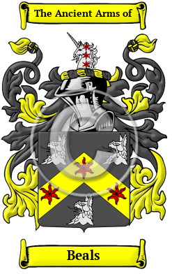
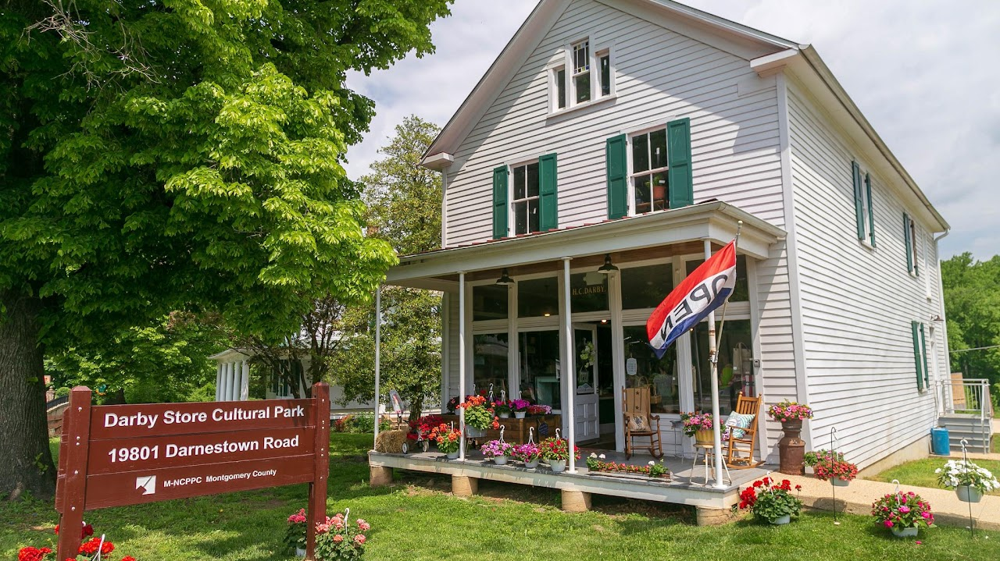
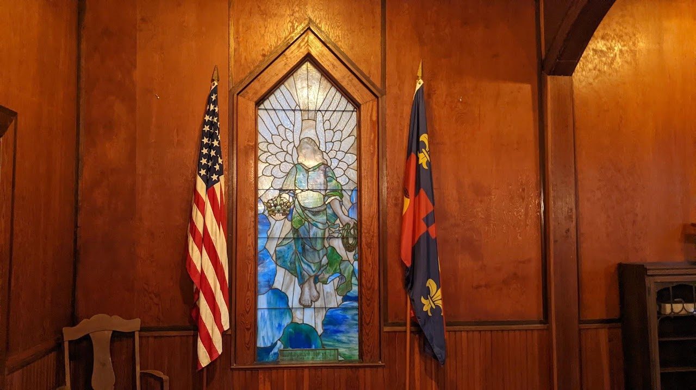

{width="2.5729166666666665in"
height="4.083333333333333in"}

[Beals](https://houseofnames.com/Beals-family-crest)

The Beals surname is thought to have been created from one of the places
so named (in Northumberland, and in West Yorkshire). The place name
derives from the Old English \"beo,\" meaning \"bee\" and \"hyll,\"
meaning \"hill.\" There is also a Norman name Beals derived from the Old
French \"bel.\" The name Beals, appeared in many references, and from
time to time, the surname was spelt Beal, Beale, Beall, Bealle, Beel,
Beele, Beales, Bealer and many more.

In the United States, the name Beals is the 4,142nd most popular surname
with an estimated 7,461 people with that name

{width="7.333333333333333in"
height="1.4781255468066492in"}

[Early Quakers](http://www.earlyquakers.org/qualifyingancestors.html)

Beal, William m Elizabeth X, settled in PA

Beal, William m Grace Gill, settled in PA

Beals, John m Margaret Hunt, settled in NC

Beals, John m Mary Clayton, settled in PA

Beals, Mary (Clayton) m John Beals, settled in PA

Beals, Thomas m Sarah Antrim, settled in OH

{width="7.47334208223972in"
height="4.197916666666667in"}

[Beallsville Historic
District](https://montgomeryparks.org/parks-and-trails/darby-store/)

Park Hours - Sunrise to Sunset

19801 Darnestown Road Beallsville, MD

301-495-2595

<Info@MontgomeryParks.org>

{width="7.5in"
height="4.2131944444444445in"}

[Monocacy Chapel](https://monocacycemetery.com/about_mc/)

Monocacy Cemetery is located at 19801 W Hunter Rd. Beallsville,
Montgomery County, Maryland

Monocacy Chapel, which was built in 1915 by the E.V. White Chapter of
the United Daughters of the Confederacy to replace an earlier chapel.
The original structure at the site, built sometime between 1734 and
1747, was a Chapel of Ease for early Anglican parishioners. A second
chapel on the site was built circa 1760. During the Civil War, Union
soldiers reportedly used this chapel as a stable for their horses and
destroyed it beyond repair.
