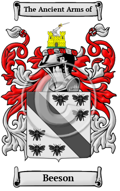

{width="2.5729166666666665in"
height="4.083333333333333in"}

[Beeson](https://houseofnames.com/Beeson-family-crest)

The name Beeson is an old Anglo-Saxon name. It comes from when a family
lived at Beeston Castle, in the county of Cheshire. Beeston is also a
village near Leeds. Bayston Hill is a large village and civil parish in
central Shropshire.  Over the years, many variations of the name Beeson
were recorded, including Beeston, Beaston, Beeson, Beason, Beestoun,
Beson and many more.

In the United States, the name Beeson is the 4,702nd most popular
surname with an estimated 7,461 people with that name
