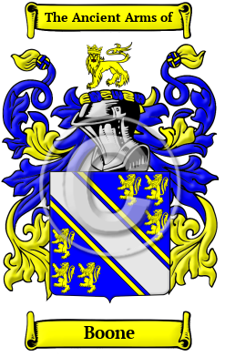

<section class="wrapper bg-light">

<article class="card shadow-lg">

{width="2.5729166666666665in"
height="4.083333333333333in"}

[Boone](https://www.houseofnames.com/boone-family-crest)

The surname Boone was first found in Sussex. Humphrey with the Beard
(died c. 1113) was a Norman soldier and nobleman fought in the Norman
Conquest of England of 1066 and is the earliest known ancestor of the de
Bohun family.  The variations of the surname Boone include Bohon, Bohun,
Bone, Boon, Boone, Bohan, Bound and many more. In the United States, the
name Boone is the 480th most popular surname with an estimated 59,688
people with that name

{width="7.416666666666667in"
height="1.625in"}

[Boone Society](https://boonesociety.org/)

The Boone Society, Inc. is an association of descendants, genealogists,
and historians who enjoy studying the lives and times of this remarkable
family. It was formed as a reference service for researchers, a conduit
for genealogists, clearing-house for bibliographical works, and to host
the biennial Boone Family Reunion. The Boone Society, which is open to
the public, is a non-profit 501 (c)(3) organization. 
