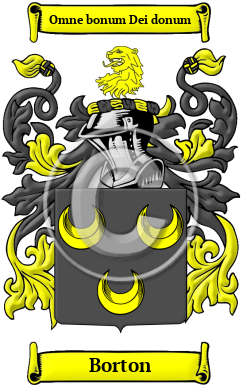

{width="2.5729166666666665in"
height="4.083333333333333in"}

[Borton](https://houseofnames.com/Borton-family-crest)

In ancient Anglo-Saxon England, the ancestors of the Borton surname
lived in one of many places called Boughton throughout England.
Settlements named Boughton were found in Huntingdonshire, Lincolnshire,
Nottinghamshire, and Northamptonshire. Great Boughton is found in
Cheshire, and Kent was home to settlements called Boughton Aluph,
Boughton Malherbe, Boughton Monchelsea, and Boughton under Blean.  The
variations of the name Borton include: Boughton, Bourton, Borton,
Boughten, Bourten, Borten, Bouton, Broughton, Portan and many more.

In the United States, the name Borton is the 10,387th most popular
surname with an estimated 2,487 people with that name
