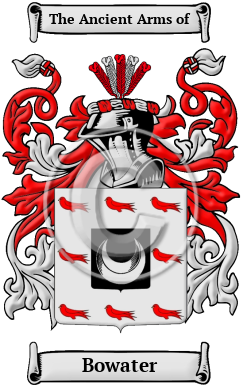

<section class="wrapper bg-light">

<article class="card shadow-lg">

{width="2.5729166666666665in"
height="4.083333333333333in"}

[Bowater](https://houseofnames.com/Bowater-family-crest)

The surname Bowater was first found in Middlesex where they held a
family seat as Lords of the Manor. The Saxon influence of English
history diminished after the Battle of Hastings in 1066. The language of
the courts was French for the next three centuries and the Norman
ambience prevailed. But Saxon surnames survived and the family name was
first referenced in the 13th century when they held estates in that
shire.  Variations  of this family name include: Bowater, Boewater,
Bowatar, Boughwater and others.
