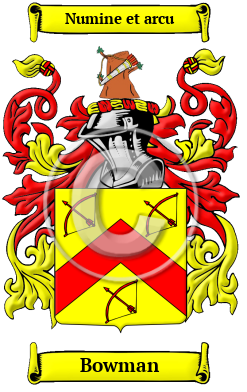

{width="2.5729166666666665in"
height="4.083333333333333in"}

[Bowman](https://houseofnames.com/Bowman-family-crest)

The name Bowman is another word for the occupational \"archer.\" Or in
other words, \"a fighting man armed with a bow; one who made bows.\"
This family name include: Bowman, Boeman, Boyman, Boman and others.

In the United States, the name Bowman is the 248th most popular surname
with an estimated 106,941 people with that name. 
