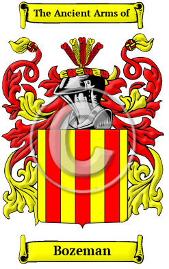

{width="2.5729166666666665in"
height="4.083333333333333in"}

[Bozeman](https://houseofnames.com/Bozeman-family-crest)

The origins of the Bozeman name lie with England\'s ancient Anglo-Saxon
culture.  Over the years, many variations of the name Bozeman were
recorded, including Basham, Bosham, Barsham, Bassham, Bashan, Bashum and
many more.

In the United States, the name Bozeman is the 4,317th most popular
surname with an estimated 7,461 people with that name.
