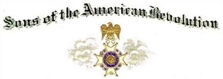

{width="3.90625in"
height="1.3958333333333333in"}

General William Campbell

**CAMPBELL, General William (1745-1781) VA**

{width="1.3541666666666667in"
height="2.1041666666666665in"}

[Clan Campbell Society](https://www.ccsna.org/)

Membership is open to all Campbells, [Campbell
septs](https://www.ccsna.org/clan-campbell-history#CAMPBELL%20SEPTS%20AND%20ASSOCIATED%20NAMES),
those married to a Campbell or Campbell Sept, those descended from [Clan
Campbell](https://www.ccsna.org/clan-campbell-history), and to those
interested in learning about the Clan Campbell, Scottish history and
culture, *and* who acknowledge *Mac Cailein Mòr* as their Clan Chief, as
he is the [Chief of Clan
Campbell](https://www.ccsna.org/chief-of-clan-campbell), the greatest
family in all of Scotland! (We\'re a \"*wee bit*\" biased.) 
