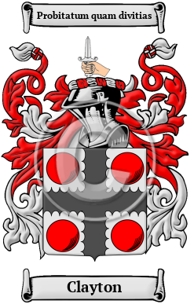

{width="2.5729166666666665in"
height="4.083333333333333in"}

[Clayton](https://houseofnames.com/Clayton-family-crest)

Clayton is an ancient Norman name that arrived in England after the
Norman Conquest of 1066. The Clayton family lived in one of the many
parishes by the name of Clayton in Staffordshire, Sussex, the West
Riding of Yorkshire and Lancashire. Cloughton is a small village and
civil parish in North Yorkshire. he name has been spelled Clayton,
Claydon, Clawton, Claughton and others.

In the United States, the name Clayton is the 468th most popular surname
with an estimated 59,688 people with that name
