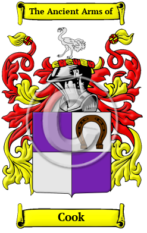
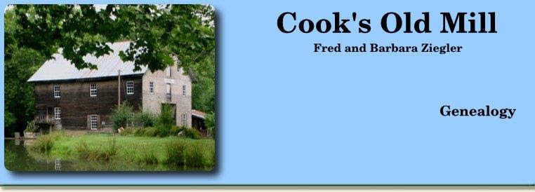

{width="2.5729166666666665in"
height="4.083333333333333in"}

[Cook](https://houseofnames.com/cook-family-crest)

The saga of the name Cook follows a line reaching back through history
to the days of the Anglo-Saxon tribes in Britain. It was a name for
someone who worked as a cook, a seller of cooked meats, or a keeper of
an eating-house. The surname Cook is derived from the Old English word
coc, which means cook. Over the years, many variations of the name Cook
were recorded, including Cooke, Cook, Cocus and others.

In the United States, the name Cook is the 56th most popular surname
with an estimated 298,440 people with that name. 

[Cook\'s Old
Mill ](https://www.firstfamilies.us/events/west-virginia/monroe-county)is
located in Monroe County West Virginia

{width="7.5in"
height="2.696527777777778in"}

[Cook\'s Old
Mill](https://www.firstfamilies.us/events/west-virginia/monroe-county)

Cook\'s Old Mill is a mid-1800\'s gristmill on route 122, just ¼ mile
west of Greenville, West Virginia. It is a privately owned park-like
venue for tourists, history buffs, Cook descendants and mill
enthusiasts. The mill is an anchor point on the Farm Heritage Road, one
of Monroe County\'s Scenic Byways. The National Registry of Historic
Places describes the mill as follows: Cook\'s Mill was built in 1857 on
the original foundation and site of an earlier mill constructed in
approximately 1796. The property surrounding this mill includes dam,
mill pond, tail race and stream, and consists of 3 ½ acres. The mill was
an important part of the community, serving as a gathering place.
Construction elements include massive hand-hewn, mortise and tenon posts
and beams.
