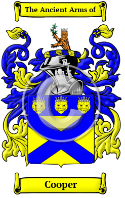

<section class="wrapper bg-light">

<article class="card shadow-lg">

{width="2.5729166666666665in"
height="4.083333333333333in"}

[Cooper](https://houseofnames.com/Cooper-family-crest)

Cooper is an Anglo-Saxon name. The name was originally given to a
cooper, a person who made and repaired barrels, casks, and buckets. It
was a trade highly valued in the Middle Ages, as the construction or
waterproof containers was no easy task with the tools of the time.
Variations under which the name Cooper has appeared include Cooper,
Cowper, Couper, Coupar and others. 

In the United States, the name Cooper is the 62nd most popular surname
with an estimated 281,031 people with that name.
