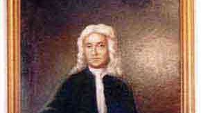
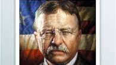
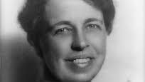

{width="3.0208333333333335in"
height="1.6979166666666667in"}

Major Edward Dale

(1628-1695)

National Society of The Colonial Dames of America 

{width="2.03125in"
height="1.1458333333333333in"}

Theodore Roosevelt

26th U.S. President

7th great-grandson

{width="2.125in"
height="1.1979166666666667in"}

Eleanor Roosevelt

First Lady of President Franklin D. Roosevelt

8th great-granddaughter
