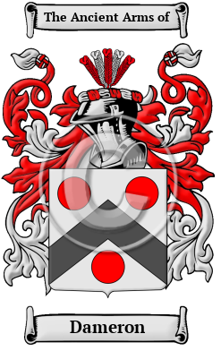

{width="2.5729166666666665in"
height="4.083333333333333in"}

[Dameron History](https://www.houseofnames.com/Dameron-family-crest)

The surname Dameron was first found in Belgium, where the name became
noted for its many branches in the region, each house acquiring a status
and influence which was envied by the princes of the region. The name
was first recorded in West Flanders, a province in Belgium, originally
Bruges. Within this province the notable towns are Bruges, the capital
city, Ostend, Courtrai, Furnes, Thielt, Ypres and Roulers. In their
later history the surname became a power unto themselves and were
elevated to the ranks of nobility as they grew into a most influential
family. The name was first recorded in Flanders about the 14th century.

In the United States, the name Dameron is the 7,419th most popular
surname with an estimated 4,974 people with that name

[Dameron Family Association](https://ddfa.org/membership)
