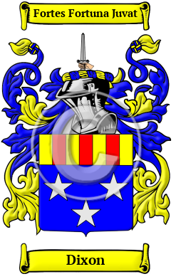

<section class="wrapper bg-light">

<article class="card shadow-lg">

{width="2.5729166666666665in"
height="4.083333333333333in"}

[Dixon](https://houseofnames.com/Dixon-family-crest)

The name Dixon originated among the descendants of the ancient Pictish
clans. It is derived from son of Dick which is a derivative of the
personal name Richard.   Dixon include Dixon, Dickson, Dixoun, Dikson,
Dyxson, Dyckson, Dicksoun, Dicson and many more.

In the United States, the name Dixon is the 139th most popular surname
with an estimated 164,142 people with that name
