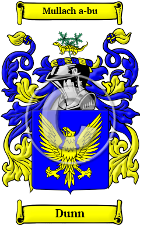

<section class="wrapper bg-light">

<article class="card shadow-lg">

{width="2.5729166666666665in"
height="4.083333333333333in"}

[Dunn](https://houseofnames.com/Dunn-family-crest)

Hundreds of years ago, the Gaelic name used by the Dunn family in
Ireland was O Duinn or O Doinn. Both Gaelic names are derived from the
Gaelic word donn, which means brown. O Doinn is the genitive case of
donn.  Variations found of the name Dunn include Dunn, Dunne, Dun,
O\'Dunne, O\'Doyne, Doine, Doin, O\'Dunn and many more.

In the United States, the name Dunn is the 160th most popular surname
with an estimated 144,246 people with that name.
