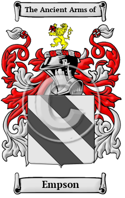

<header class="wrapper bg-light">
  
</header>

<section class="wrapper bg-light">

<article class="card shadow-lg">

[Empson](https://houseofnames.com/Empson-family-crest)

The Anglo-Saxon name Empson comes from the son of Emery. Over the years,
many variations of the name Empson were recorded, including Empson,
Emson and others.
