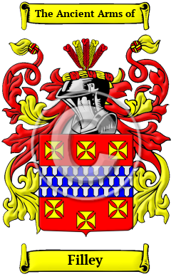

<section class="wrapper bg-light">

<article class="card shadow-lg">

{width="2.5729166666666665in"
height="4.083333333333333in"}

[Filley](https://houseofnames.com/Filley-family-crest)

The surname Filley was first found in Essex where the name was first
referenced in the year 1245 when Richard was recorded as Fitz le Roy,
essentially \'son of the King\' and we may allude to the reference to be
that of King John. However, there was an earlier family of Fitzroy who
was the illegitimate son of King Henry I about 1140.   Known variations
of the Filley family name include Fillery, Filley, Fillary, Fildry,
Filary, Filery, Filey, Fillie, Fildery, Filleigh, Fitzroy, Fitzroi and
many more.

{width="1.6666666666666667in"
height="0.9375in"}

SGT Roger Filley

Ancestor ID: 11928    Rank: Sgt  Unit:   

    Pension: No  Land Bounty: No   Service: Militia   State Served: KY

    Spouse:  Abiah Hale

    Birth Date:  May 25 1771   State:  CT

    Death Date:  Jan 23 1815   State:  LA
