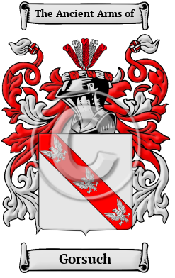

{width="2.5729166666666665in"
height="4.083333333333333in"}

[Gorsuch](https://houseofnames.com/Gorsuch-family-crest)

The surname Gorsuch was first found in Lancashire at Gosfordsich (later
named Gorsuch.)  This family name include: Gossage, Gostage, Gorstidge,
Gorstice, Gorstage, Gostige, Gossidge, Gossadge, Gossedge and many more.

In the United States, the name Gorsuch is the 12,214th most popular
surname with an estimated 2,487 people with that name.
