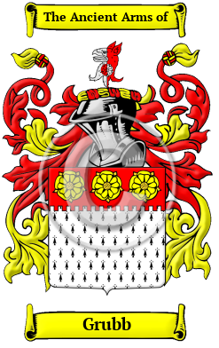
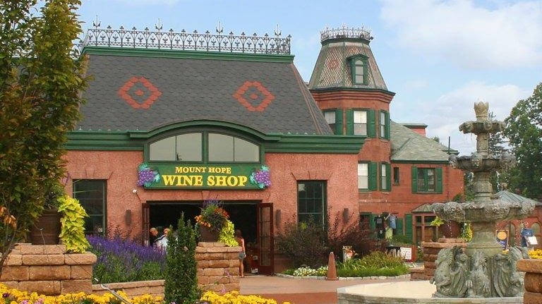

<section class="wrapper bg-light">

<article class="card shadow-lg">

{width="2.5729166666666665in"
height="4.083333333333333in"}

[Grubb](https://houseofnames.com/Grubb-family-crest)

The surname Grubb was first found in Berkshire, where the family was
first referenced in the year 1176 when Richard and John Grubb held
estates in that shire. Variations of this family name include: Grubb,
Grub, Grubbe, Groube, Groub and others.  

In the United States, the name Grubb is the 2,166th most popular surname
with an estimated 14,922 people with that name.

[Grubb Worth
Mansion](https://www.firstfamilies.us/events/delaware/new-castle)

[Mount Hope
Estate](https://www.firstfamilies.us/events/pennsylvania/lancaster)

{width="7.5in"
height="4.209027777777778in"}

[Mount Hope](https://mounthope.estate/?v=0b3b97fa6688)

Mount Hope began as the summer home for four generations of the Grubb
family, an early American iron master family who found their way from
England seeking their fortune. The properties that were to become the
Estate were purchased in 1779 and Peter Grubb established an iron
furnace at Mount Hope in 1784. His son, Henry Bates Grubb, built the
original Federal Period Mansion between 1800-1805. 

717.665.7021       <WineShop@PaRenFaire.com>

2775 Lebanon Road Manheim, PA 17545
