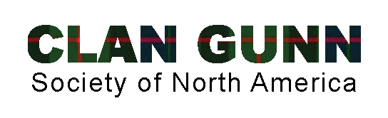

{width="5.666666666666667in"
height="1.7291666666666667in"}

[Clan Gunn](https://cgsna.org/membership/)

Clan Gunn Society of North America (CGSNA) is a nonprofit 501(c)(3)
whose mission is to promote and preserve Scottish history, culture, and
heritage and to preserve and distribute information of interest to those
of the surname, Gunn and its families, regardless of spelling. We work
closely with the Clan Gunn Society located in Scotland and our members
to provide resources on our Scottish Cultural Heritage in the North
American region.
